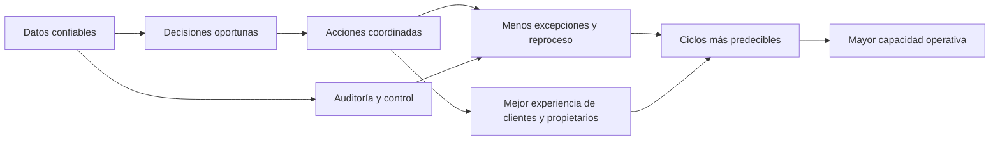
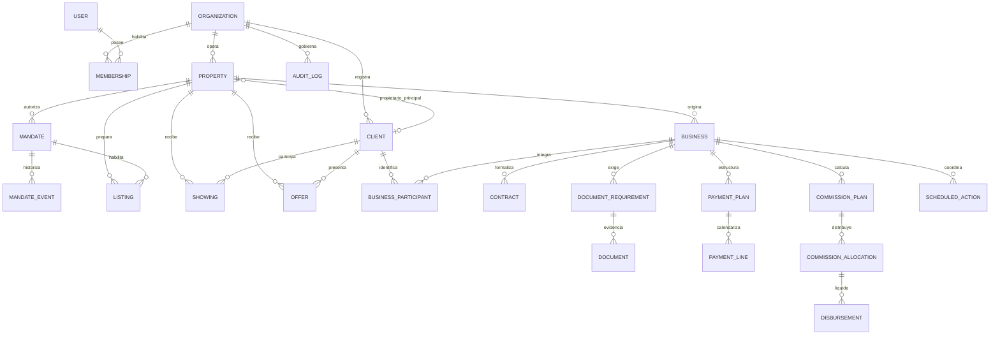
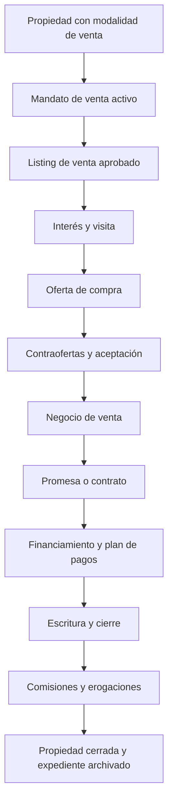
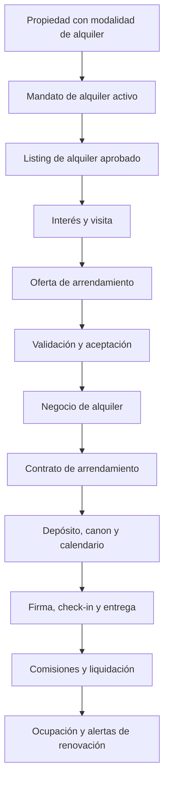
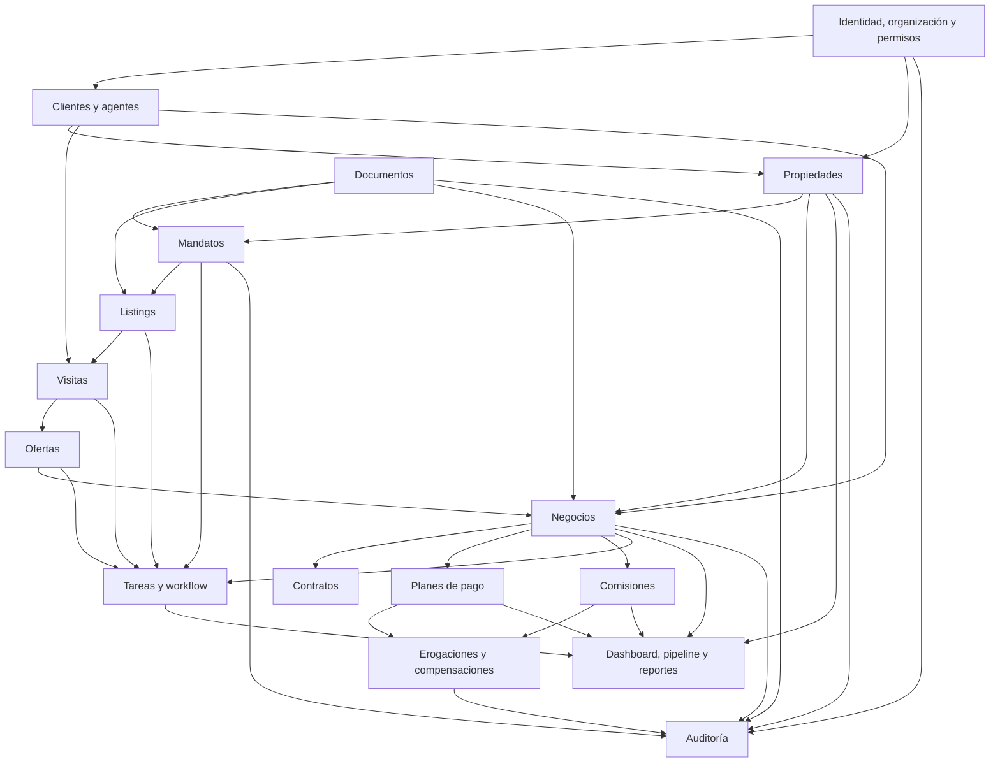
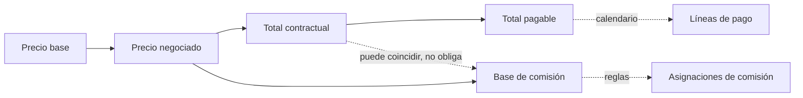
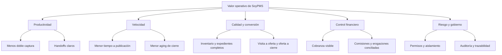
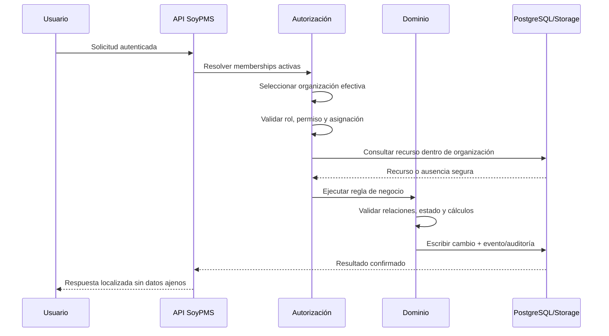

# SoyPMS: sinopsis maestra de producto y modelo operativo

> Documento rector de producto para estrategia, diseño operativo, presentaciones,
> alianzas, formación y evolución funcional. No es una pieza comercial, una
> promesa contractual ni una descripción exclusiva del estado técnico actual.

## 0. Propósito, alcance y método de lectura

### 0.1 Propósito

Este documento define SoyPMS como sistema de producto: qué es, por qué existe,
cómo organiza la operación inmobiliaria, qué entidades y procesos gobierna, qué
problemas resuelve y mediante qué variables puede medirse su valor.

Su función es servir como fuente maestra para producir, sin reinterpretar el
producto, materiales dirigidos a:

- empresas inmobiliarias y brokers;
- equipos comerciales, operativos, documentales y financieros;
- inversionistas y comités de dirección;
- aliados tecnológicos, portales, proveedores y co-brokers;
- equipos de implementación, soporte, producto e ingeniería;
- programas de onboarding, adopción y capacitación.

La tesis central es deliberadamente simple:

> Una empresa inmobiliaria no opera solamente contactos ni anuncios. Opera el
> ciclo completo de inmuebles que deben convertirse, de forma autorizada,
> documentada, comercializable, negociable y auditable, en transacciones
> cerradas.

### 0.2 Alcance

El núcleo de SoyPMS cubre la operación de brokers, inmobiliarias y equipos
comerciales desde la captación hasta el cierre, el archivo y el análisis. Incluye
identidad empresarial, inventario, clientes, mandatos, expedientes,
publicaciones, visitas, ofertas, negocios, contratos, planes de pago,
comisiones, erogaciones, tareas, reportes y auditoría.

El horizonte de expansión incorpora capacidades adyacentes que se apoyan en ese
mismo modelo: firma electrónica, publicación en portales, portal de
propietarios, inteligencia documental, co-brokerage, alquiler avanzado,
integraciones contables, reportes avanzados y API pública.

No se redefine SoyPMS como:

- CRM genérico para cualquier industria;
- ERP o sistema de contabilidad general;
- marketplace público o MLS completo;
- property management enterprise;
- banco, pasarela de pagos o custodio de fondos;
- proveedor universal de KYC;
- repositorio de archivos sin lógica operativa.

### 0.3 Marco global neutral

El documento usa conceptos operativos internacionales y evita imponer leyes,
impuestos, documentos o rituales de cierre propios de un país. Cada organización
puede configurar requisitos, plantillas, monedas, participantes, etapas y
controles conforme a su jurisdicción y modelo de negocio.

Las capacidades regulatorias se entienden como infraestructura configurable,
no como asesoría legal ni como garantía automática de cumplimiento.

### 0.4 Jerarquía de verdad

La definición se construye con esta precedencia:

1. contrato vigente de producto en `CODEX.md`;
2. modelos, reglas y comportamiento comprobables en la implementación;
3. contratos funcionales de `docs/modules/`;
4. arquitectura y planes de producto de `docs/architecture/` y `docs/product/`;
5. material histórico de `References/`, únicamente como antecedente.

El cuerpo describe la visión integrada del sistema. El anexo de madurez separa
lo operativo, lo formalmente diseñado y la expansión futura para no confundir
visión con disponibilidad.

---

## 1. Doctrina de producto

### 1.1 Definición

SoyPMS es un sistema operativo inmobiliario SaaS, multiusuario y modular,
centrado en el inmueble como producto operativo, documental, comercial,
financiero y transaccional.

Su objetivo no es acumular registros. Su objetivo es convertir información
fragmentada en una operación coordinada en la que cada persona autorizada pueda
responder, con evidencia:

- qué inmuebles existen y en qué condición se encuentran;
- quién puede comercializarlos y bajo qué términos;
- qué información o documentos bloquean su avance;
- dónde, cuándo y con qué contenido están siendo ofrecidos;
- qué interesados, visitas, ofertas y negociaciones existen;
- qué negocio se está estructurando y quién participa;
- qué debe firmarse, cobrarse, pagarse o liquidarse;
- qué responsabilidades y fechas están pendientes;
- qué ocurrió, quién actuó y qué cambió;
- qué riesgos, ingresos y cierres puede anticipar la organización.

### 1.2 Categoría

SoyPMS pertenece a la categoría de **real estate operations system** o sistema
operativo inmobiliario. Combina coordinación de trabajo, dominio transaccional,
gobierno de datos y lectura gerencial alrededor del ciclo del inmueble.

| Categoría adyacente | Qué hace normalmente                                        | Diferencia de SoyPMS                                                                                                 |
| ------------------- | ----------------------------------------------------------- | -------------------------------------------------------------------------------------------------------------------- |
| CRM genérico        | Gestiona contactos, actividades y oportunidades             | El cliente es central, pero la propiedad, la autorización, el expediente y la transacción tienen modelos propios.    |
| Gestor de listings  | Publica o distribuye anuncios                               | La publicación es solo una fase posterior al mandato y al readiness.                                                 |
| Gestor documental   | Almacena y clasifica archivos                               | Los documentos tienen requisitos, vigencia, revisión, bloqueos, versiones y relación con estados del negocio.        |
| Kanban comercial    | Mueve oportunidades entre columnas                          | Las etapas se conectan con entidades, reglas, permisos, dinero y auditoría.                                          |
| ERP contable        | Registra contabilidad corporativa                           | SoyPMS controla obligaciones y eventos operativos del negocio, sin sustituir el libro mayor.                         |
| Property management | Administra ocupación, mantenimiento y activos estabilizados | SoyPMS se concentra en captación, comercialización y ejecución transaccional; el alquiler avanzado es una extensión. |
| Marketplace o MLS   | Expone oferta y facilita descubrimiento                     | SoyPMS gobierna la operación privada de la empresa; la distribución externa es una integración.                      |

### 1.3 Unidad central: el inmueble como producto

El inmueble (`property`) es el registro maestro del activo que la empresa desea
operar. No es equivalente a una publicación, una oportunidad o un contrato.

Alrededor del inmueble se conectan:

- la identidad del propietario y demás clientes;
- la autorización comercial o mandato;
- las evidencias documentales;
- la preparación del contenido y los materiales;
- una publicación de venta y/o una publicación de alquiler;
- las visitas y su resultado;
- las ofertas y contraofertas;
- los negocios y contratos resultantes;
- las tareas, pagos, comisiones, eventos y auditoría.

Esta centralidad evita que cada área cree su propia versión del inmueble y
permite observar un mismo activo a lo largo del tiempo.

### 1.4 Frontera empresarial: la organización

La organización (`organization`) representa al cliente SaaS: inmobiliaria,
brokerage, equipo o empresa. Es simultáneamente:

- frontera de propiedad de los datos;
- contexto de memberships, roles y permisos;
- ámbito de configuraciones y plantillas;
- unidad de operación, métricas y auditoría;
- límite para búsquedas, relaciones, archivos, tareas e idempotencia.

Un identificador de organización recibido desde una interfaz nunca concede
acceso por sí mismo. El acceso deriva de la identidad autenticada y de una
membership activa.

### 1.5 Principios no negociables

1. **Una fuente de verdad por concepto.** Clientes, propiedades, mandatos,
   documentos y negocios no se duplican para resolver necesidades de una vista.
2. **La autorización precede a la comercialización.** Un inmueble puede
   prepararse, pero no debe presentarse como habilitado sin mandato y controles
   vigentes.
3. **Venta y alquiler comparten infraestructura, no identidad de proceso.**
   Conservan reglas, importes, documentos, fechas y cierres propios.
4. **La configuración pertenece a la organización.** Etapas, requisitos y
   políticas no deben quedar incrustados como constantes universales.
5. **El servidor es la autoridad.** La interfaz orienta; permisos, validaciones,
   cálculos y transiciones se confirman en la capa confiable.
6. **Todo cambio crítico deja evidencia.** Estado anterior, estado nuevo,
   actor, fecha, motivo y contexto se conservan cuando aplica.
7. **La historia no se corrige destruyéndola.** Se reemplaza, cancela, archiva,
   revierte o versiona; las entidades críticas no se eliminan como rutina.
8. **El dinero se modela explícitamente.** Precio, obligación, cobro, comisión y
   desembolso son conceptos relacionados pero distintos.
9. **La automatización sigue al proceso comprendido.** Primero se validan las
   transiciones manuales; luego se agregan recordatorios, jobs e integraciones.
10. **La utilidad operativa precede a la apariencia.** Cada vista debe ayudar a
    decidir, actuar o comprender una excepción.

---

## 2. Sistema de problemas de la empresa inmobiliaria

### 2.1 Tesis del problema

La fragmentación inmobiliaria no es solo tecnológica. Es una fragmentación de
responsabilidades, significados y tiempos. Un mismo inmueble puede existir como
fila de inventario, carpeta documental, anuncio, conversación, visita, oferta,
contrato y cálculo de comisión sin una identidad común. La consecuencia es que
cada equipo trabaja con una verdad parcial.

SoyPMS resuelve ese problema organizando cuatro continuidades:

1. **continuidad del activo:** el inmueble conserva identidad durante todo el ciclo;
2. **continuidad de autorización:** los términos comerciales se conectan con el mandato vigente;
3. **continuidad transaccional:** oferta, negocio, contrato, pagos y comisión mantienen relaciones explícitas;
4. **continuidad de evidencia:** documentos, eventos, tareas y decisiones conservan contexto e historial.

### 2.2 Taxonomía de dolores y respuesta

| Dominio       | Dolor estructural                                        | Causa raíz                                      | Manifestación observable                             | Riesgo o costo                                      | Respuesta de SoyPMS                                             | Cambio operativo                                              | KPI indicativo                                                |
| ------------- | -------------------------------------------------------- | ----------------------------------------------- | ---------------------------------------------------- | --------------------------------------------------- | --------------------------------------------------------------- | ------------------------------------------------------------- | ------------------------------------------------------------- |
| Estrategia    | La dirección no conoce la condición real de la operación | Datos dispersos y métricas sin definición común | Reportes manuales que no coinciden                   | Decisiones tardías, forecast débil                  | Modelo integrado y dashboards por alcance                       | La lectura gerencial deriva de eventos y entidades operativas | Cobertura de datos, forecast, aging por etapa                 |
| Inventario    | No existe certeza sobre qué inmuebles están disponibles  | Fichas duplicadas y estados no gobernados       | El mismo activo aparece activo, reservado y retirado | Promesas erróneas y pérdida de confianza            | Registro maestro de propiedad con estados e historial           | Un cambio de condición actualiza la fuente común              | Exactitud de inventario, duplicidad, tiempo sin actualización |
| Comercial     | El equipo trabaja oportunidades sin contexto completo    | CRM y activos viven separados                   | Contactos sin propiedad, propiedad sin responsable   | Seguimiento reactivo y baja conversión              | Clientes centralizados relacionados con propiedades y negocios  | Cada interacción se ancla a un contexto operativo             | Conversión, próxima acción, tiempo en etapa                   |
| Captación     | Se comercializan inmuebles con autorización incierta     | Mandatos en correo, papel o memoria             | Términos, vigencia o exclusividad desconocidos       | Conflictos, exposición legal y esfuerzo perdido     | Lifecycle de mandatos con evidencia y readiness                 | La autorización se convierte en gate verificable              | Mandatos activos, por vencer y bloqueados                     |
| Documentación | El expediente se arma al final                           | Requisitos genéricos y carpetas sin estados     | Archivos faltantes o versiones incorrectas en cierre | Retrasos, reproceso y riesgo contractual            | Plantillas, snapshots, revisión, vigencia y bloqueos            | La preparación documental acompaña el ciclo                   | Completitud, tiempo de aprobación, bloqueantes                |
| Publicación   | Los anuncios son inconsistentes o no trazables           | Copy y materiales se crean por canal            | Precios o descripciones distintas en cada destino    | Daño reputacional y leads de baja calidad           | Listing separado con readiness, aprobación y canales            | Se aprueba una versión comercial antes de publicar            | Tiempo a publicación, rechazos, cambios posteriores           |
| Visitas       | La agenda no produce aprendizaje acumulado               | Calendarios y feedback desconectados            | No-shows, reprogramaciones y notas perdidas          | Tiempo improductivo y mala experiencia              | Visitas con participantes, estado, resultado y siguiente acción | Cada visita genera un resultado accionable                    | Confirmación, no-show, feedback, visita a oferta              |
| Negociación   | Las condiciones cambian sin una versión común            | Ofertas tratadas como mensajes                  | No se sabe qué versión está vigente                  | Disputas, demoras y pérdida de margen               | Oferta y contraoferta con estados, vigencia e historial         | La decisión se toma sobre condiciones identificables          | Oferta a aceptación, expiración, rondas de negociación        |
| Transacción   | El cierre se coordina como proyecto informal             | Contratos, pagos y tareas no están conectados   | Dependencias críticas aparecen tarde                 | Cierres impredecibles y cancelaciones               | Negocio como expediente transaccional central                   | Responsables y gates se organizan alrededor del cierre        | Días a cierre, bloqueos, cancelación, cumplimiento de hitos   |
| Finanzas      | Precio, cobro, comisión y pago se confunden              | Cálculos en hojas independientes                | Totales incompatibles o dobles contabilizaciones     | Fuga de margen y disputas internas                  | Montos separados, snapshots, planes y ledger de erogaciones     | Cada obligación tiene base, estado y receptor                 | Desviación, vencido, comisión pendiente, saldo aplicado       |
| Comisiones    | No hay claridad sobre quién tiene derecho a qué          | Splits asociados a nombres libres               | Duplicados, receptores sin identidad, pagos ambiguos | Conflicto humano y sobrepago                        | Participantes registrados, reglas y asignaciones                | El derecho económico se valida antes del pago                 | Comisión por estado, tiempo a pago, excepciones               |
| Gobierno      | Las acciones sensibles no tienen autor ni contexto       | Cambios directos y permisos amplios             | Imposibilidad de explicar decisiones pasadas         | Fraude, error no detectable y débil control interno | Roles, autorización por recurso y auditoría                     | Las decisiones críticas son atribuibles                       | Cobertura de auditoría, accesos rechazados, reversión         |
| Tecnología    | Cada mejora crea otra isla                               | Herramientas puntuales sin modelo común         | Integraciones frágiles y datos irreconciliables      | Alto costo de cambio                                | Monolito modular, API y entidades canónicas                     | Las extensiones reutilizan contratos del núcleo               | Integridad, fallos de sincronización, deuda de integración    |

### 2.3 Cómo se produce el valor

SoyPMS no crea valor por digitalizar una pantalla aislada. Lo crea al reducir
las discontinuidades entre áreas:

El producto debe demostrar esa cadena mediante datos operativos. No debe asumir
que más registros, pantallas o automatizaciones equivalen automáticamente a
mejores resultados.

---

## 3. Modelo conceptual y ontología

### 3.1 Capas del modelo

| Capa                  | Pregunta que responde                            | Entidades principales                        |
| --------------------- | ------------------------------------------------ | -------------------------------------------- |
| Identidad SaaS        | ¿Quién accede y en nombre de qué empresa?        | Organization, User, Membership               |
| Participantes         | ¿Qué personas o empresas intervienen?            | Client, RealEstateAgent, BusinessParticipant |
| Activo                | ¿Qué inmueble se opera?                          | Property                                     |
| Autorización          | ¿Con qué derecho y términos se comercializa?     | Mandate, MandateEvent                        |
| Preparación comercial | ¿Qué versión del producto se ofrece?             | Listing, materiales, canales                 |
| Demanda y negociación | ¿Quién mostró interés y qué propuso?             | Showing, Offer                               |
| Transacción           | ¿Qué operación se acordó y cómo se ejecuta?      | Business, Contract, clauses, fees            |
| Evidencia             | ¿Qué requisitos y archivos sustentan el proceso? | Document, template, checklist, requirement   |
| Dinero                | ¿Qué se debe cobrar, reconocer o pagar?          | PaymentPlan, CommissionPlan, Disbursement    |
| Coordinación          | ¿Qué debe ocurrir, quién responde y cuándo?      | WorkflowStage, ScheduledAction, Task         |
| Gobierno              | ¿Qué cambió, por quién y con qué efecto?         | AuditLog, snapshots, event histories         |

### 3.2 Definiciones y relaciones cardinales

#### Organización

Cuenta empresarial que contrata y opera SoyPMS. Una organización tiene muchas
memberships, clientes, propiedades, configuraciones, negocios y eventos. No
comparte implícitamente recursos con otra organización.

#### Usuario y membership

El usuario representa una identidad humana global. La membership representa su
relación con una organización, incluido rol y estado. Una persona puede tener
acceso a más de una organización sin que los permisos de una se trasladen a otra.

#### Cliente

Persona o empresa que participa en el ecosistema comercial: comprador,
vendedor, arrendador, arrendatario, inversionista, lead, referidor o contacto
relacionado. Una sola identidad puede desempeñar varios roles y participar en
múltiples propiedades o negocios.

#### Agente inmobiliario

Persona registrada por su función de intermediación: broker, broker externo o
referidor. Puede coexistir con una identidad de usuario o cliente, pero sus
responsabilidades y derechos económicos deben enlazarse de forma explícita.

#### Propiedad

Registro maestro del inmueble. Contiene identidad operativa, ubicación,
características, modalidades, precios de referencia, propietario relacionado,
responsable y estado. Puede tener muchos mandatos históricos, listings, visitas,
ofertas, documentos y negocios.

#### Mandato

Autorización comercial otorgada por el propietario a la organización. Define
modalidad, vigencia, exclusividad, precio autorizado, moneda, comisión y
responsable. Pertenece a una propiedad y puede tener un sucesor; no es una venta,
un alquiler ni una publicación.

#### Publicación o listing

Versión comercial preparada para una modalidad concreta. Contiene título, copy,
precio visible, materiales, canales, readiness y aprobación. Una propiedad con
mandato para ambas modalidades puede tener un listing de venta y otro de
alquiler; no un listing ambiguo para ambas.

#### Visita

Interacción programada alrededor de una propiedad, con participantes,
responsables, fecha, estado, resultado, feedback y próxima acción. Puede
relacionarse con un cliente y un negocio.

#### Oferta

Propuesta comercial identificable, con modalidad, importe, moneda, términos,
vigencia, estado y relaciones. La contraoferta representa una nueva versión o
evento negociador; una aceptación debe generar o enlazar un único negocio de
forma idempotente.

#### Negocio

Expediente transaccional que ejecuta una venta, alquiler, reserva, separación,
preventa, cesión u otra operación aprobada. Relaciona propiedad, participantes,
contrato, documentos, importes, planes, tareas, pagos, comisiones y cierre.

#### Contrato

Instrumento que formaliza condiciones del negocio. Tiene tipo, versión, estado,
cláusulas, participantes y evidencia. Puede coexistir con adendas y anexos sin
que estos borren el contrato original.

#### Documento y requisito documental

El documento es una evidencia o archivo. El requisito define qué evidencia se
espera, cuándo, para quién y si bloquea una transición. Las plantillas generan
snapshots para que un cambio de configuración no altere retrospectivamente un
expediente.

#### Plan de pagos

Estructura de obligaciones asociadas al total pagable. Se materializa en líneas
con concepto, fecha, importe, fuente y estado. No es sinónimo de dinero cobrado.

#### Plan y asignación de comisiones

El plan define base, reglas y política de liberación. Cada asignación reconoce
el derecho económico de un participante identificado y progresa hasta ser
pagadera y pagada.

#### Erogación y compensación

La erogación representa una obligación de salida hacia un receptor. Puede
pagarse directamente o convertirse en saldo a favor. Una compensación aplica
ese saldo a otra operación compatible, con movimientos reversibles y auditados.

#### Tarea, acción programada y etapa

La etapa organiza el estado de un flujo configurable. La tarea asigna trabajo
humano. La acción programada representa un evento temporal o automatizable. No
deben tratarse como el mismo concepto.

#### Auditoría y snapshots

La auditoría registra acciones sensibles. Los historiales de dominio registran
transiciones. Los snapshots conservan el cálculo o configuración utilizado en
un momento. Juntos permiten reconstruir decisiones sin depender del estado
actual.

### 3.3 Separaciones conceptuales críticas

| Conceptos que no deben confundirse | Distinción                                                                                             |
| ---------------------------------- | ------------------------------------------------------------------------------------------------------ |
| Organización / cliente             | La organización compra el SaaS; el cliente participa en la operación inmobiliaria.                     |
| Propiedad / listing                | La propiedad es el activo maestro; el listing es una preparación comercial por modalidad.              |
| Propiedad / negocio                | Un inmueble puede tener múltiples negocios históricos; el negocio es una ejecución transaccional.      |
| Mandato / contrato                 | El mandato autoriza comercializar; el contrato formaliza una transacción.                              |
| Cliente / participante             | El cliente es una identidad maestra; el participante representa su rol dentro de un negocio.           |
| Documento / requisito              | El archivo es evidencia; el requisito es una obligación configurable que puede o no estar satisfecha.  |
| Precio / total pagable             | El primero expresa valor comercial; el segundo alimenta obligaciones de pago.                          |
| Comisión / erogación               | La comisión reconoce un derecho; la erogación ejecuta o compensa una salida.                           |
| Etapa / estado                     | La etapa organiza un flujo configurable; el estado expresa una condición gobernada del recurso.        |
| Auditoría / actividad              | La actividad puede informar contexto; la auditoría debe ser confiable para explicar acciones críticas. |

### 3.4 Mapa entidad–relación conceptual

---

## 4. Cadena de valor inmobiliaria end-to-end

### 4.1 Flujo general

```mermaid
flowchart LR
  A["Captación"] --> B["Propiedad y propietario"]
  B --> C["Mandato"]
  C --> D["Expediente y readiness"]
  D --> E["Preparación comercial"]
  E --> F["Publicación"]
  F --> G["Interés y visitas"]
  G --> H["Oferta y negociación"]
  H --> I["Negocio y contratos"]
  I --> J["Pagos y comisiones"]
  J --> K["Cierre y entrega"]
  K --> L["Archivo, auditoría y análisis"]
  D -. bloquea .-> E
  C -. vigencia .-> F
  I -. hitos .-> J
```

### 4.2 Ficha estándar de proceso

Cada fase se describe con la misma estructura:

- **propósito:** resultado empresarial que persigue;
- **entradas:** información o estados necesarios;
- **participantes:** responsables, aprobadores y personas relacionadas;
- **decisiones:** elecciones que alteran el recorrido;
- **reglas y controles:** invariantes confiables;
- **excepciones:** condiciones que impiden o desvían el avance;
- **salidas:** entidades, eventos o estados producidos;
- **dependencias:** módulos que proporcionan contexto;
- **métricas:** señales para evaluar calidad y velocidad.

### 4.3 Etapas de la cadena

#### 1. Captación

- **Propósito:** convertir una oportunidad de inventario en un caso operativo identificable.
- **Entradas:** referencia del inmueble, fuente, contacto inicial y responsable.
- **Participantes:** broker, agente, operaciones y propietario potencial.
- **Decisiones:** aceptar evaluación, descartar, solicitar información o continuar alta.
- **Reglas:** no crear identidades duplicadas; registrar fuente y próximo paso.
- **Excepciones:** información insuficiente, activo fuera de estrategia, contacto no autorizado.
- **Salidas:** cliente relacionado, borrador de propiedad y tarea de seguimiento.
- **Dependencias:** clientes, usuarios, agentes y configuración.
- **Métricas:** captaciones por fuente, tiempo a alta, conversión a mandato.

#### 2. Alta del inmueble y relación con propietario

- **Propósito:** construir la fuente maestra del activo.
- **Entradas:** modalidad, ubicación, tipo, atributos, moneda, precios y propietario.
- **Participantes:** agente responsable, operaciones y propietario.
- **Decisiones:** venta, alquiler o ambas; responsable; condición operativa.
- **Reglas:** al menos una modalidad; precios no negativos; responsable y propietario dentro de la organización.
- **Excepciones:** duplicidad, propiedad retirada, datos geográficos o comerciales incompletos.
- **Salidas:** propiedad con estado e identidad estables.
- **Dependencias:** clientes, memberships y catálogo configurable.
- **Métricas:** completitud, duplicidad, tiempo de captura, inventario por estado.

#### 3. Mandato

- **Propósito:** formalizar el derecho de la organización a ofrecer el inmueble.
- **Entradas:** propiedad, propietario, modalidad, precio autorizado, vigencia, exclusividad, comisión y evidencia.
- **Participantes:** propietario, broker, operaciones, agente y aprobador.
- **Decisiones:** presentar, devolver, registrar firma, activar, cancelar, renovar o archivar.
- **Reglas:** términos materiales completos; firma no futura; vigencia válida; modalidad compatible; conflictos de exclusividad controlados.
- **Excepciones:** evidencia ausente, documentos bloqueantes, mandato solapado, fechas inválidas o responsable sin acceso.
- **Salidas:** mandato activo o estado terminal, historial y readiness comercial.
- **Dependencias:** propiedades, clientes, documentos, permisos y auditoría.
- **Métricas:** tasa de activación, tiempo a firma, mandatos por vencer, conflictos y renovaciones.

#### 4. Expediente documental

- **Propósito:** demostrar que personas, inmueble, autorización y transacción cuentan con evidencias suficientes.
- **Entradas:** plantilla aplicable, requisitos libres, archivos, fechas y permisos.
- **Participantes:** operaciones, agentes, cliente, legal, finanzas y revisores.
- **Decisiones:** cargar, revisar, observar, aprobar, rechazar, reemplazar, vencer o declarar no aplicable.
- **Reglas:** snapshots por negocio; versiones inmutables; permisos por sensibilidad; bloqueo solo cuando esté configurado.
- **Excepciones:** archivo inválido, relación ajena, vencimiento, observación, requisito obligatorio sin evidencia.
- **Salidas:** checklist, porcentaje de completitud, bloqueantes e historial.
- **Dependencias:** plantillas, Storage privado, clientes, propiedades, mandatos, negocios y contratos.
- **Métricas:** completitud, tiempo de revisión, reemplazos, bloqueantes y antigüedad del pendiente.

#### 5. Preparación comercial

- **Propósito:** convertir un activo autorizado en una propuesta de mercado coherente.
- **Entradas:** propiedad, mandato, precio, moneda, copy, portada, galería y canales.
- **Participantes:** agente, marketing, operaciones, broker y aprobador.
- **Decisiones:** declarar listo, devolver a preparación o aprobar.
- **Reglas:** listing único no terminal por propiedad y modalidad; readiness calculado en servidor; cambios materiales invalidan aprobación.
- **Excepciones:** mandato no vigente, información incompleta, material ausente, texto demostrativo o precio inválido.
- **Salidas:** listing listo y aprobado con snapshot de readiness.
- **Dependencias:** propiedad, mandato, documentos, materiales y permisos.
- **Métricas:** tiempo de preparación, bloqueantes, ciclos de corrección y porcentaje listo.

#### 6. Publicación

- **Propósito:** registrar de manera controlada dónde y desde cuándo se ofrece el inmueble.
- **Entradas:** listing aprobado, canales seleccionados y readiness vigente.
- **Participantes:** marketing, operaciones, broker y agente.
- **Decisiones:** publicar, pausar, reanudar, retirar o archivar.
- **Reglas:** publicación interna no equivale a confirmación de un portal externo; reanudar exige revalidación.
- **Excepciones:** vencimiento del mandato, cambio material, canal no disponible o retiro del propietario.
- **Salidas:** estado publicado, eventos por canal y tareas de regularización.
- **Dependencias:** listing, mandato, workflow y futuras integraciones.
- **Métricas:** tiempo a publicación, canales por listing, pausas, retiro y vigencia del contenido.

#### 7. Gestión de interesados y visitas

- **Propósito:** transformar atención en interacción calificada y aprendizaje comercial.
- **Entradas:** cliente, propiedad/listing, disponibilidad, responsables y preferencias.
- **Participantes:** comprador o arrendatario, agente, propietario, broker externo y operaciones.
- **Decisiones:** solicitar, confirmar, reprogramar, completar, cancelar o registrar no-show.
- **Reglas:** agenda y participantes pertenecen al mismo contexto; cada resultado genera feedback o próxima acción.
- **Excepciones:** acceso no autorizado, conflicto de agenda, propiedad no disponible o falta de confirmación.
- **Salidas:** visita, resultado, feedback y seguimiento.
- **Dependencias:** clientes, propiedades, agentes, tareas y pipeline.
- **Métricas:** confirmación, reprogramación, no-show, feedback capturado y visita a oferta.

#### 8. Oferta y negociación

- **Propósito:** convertir intención en condiciones decidibles y trazables.
- **Entradas:** cliente, inmueble, modalidad, importe, moneda, términos y vigencia.
- **Participantes:** comprador o arrendatario, vendedor o arrendador, agentes, broker y asesores.
- **Decisiones:** enviar, contraofertar, aceptar, rechazar, retirar o dejar expirar.
- **Reglas:** versiones identificables; una oferta terminal no se reescribe; aceptación idempotente hacia negocio.
- **Excepciones:** vigencia vencida, propiedad no disponible, importe inválido, participante ajeno o aceptación concurrente.
- **Salidas:** resultado de negociación y negocio enlazado cuando se acepta.
- **Dependencias:** clientes, propiedad, visitas, documentos, negocios y auditoría.
- **Métricas:** tiempo a respuesta, rondas, aceptación, expiración, descuento y visita a oferta.

#### 9. Estructuración del negocio

- **Propósito:** convertir el acuerdo en una transacción ejecutable.
- **Entradas:** propiedad, participantes, operación, precios, condiciones, contrato, fechas y documentos.
- **Participantes:** partes, agente principal, co-agente, broker, operaciones, legal, finanzas, notaría o banco según el caso.
- **Decisiones:** modalidad simple o avanzada, importes, cláusulas, hitos, plan de pagos y plan de comisiones.
- **Reglas:** recálculo server-side; relaciones dentro de organización; preview antes de confirmar; snapshots de cálculo.
- **Excepciones:** totales incompatibles, participante duplicado, ajuste inválido, requisito bloqueante o contrato incompleto.
- **Salidas:** negocio confirmado con contratos, planes, participantes y tareas.
- **Dependencias:** todos los módulos previos más finanzas y workflow.
- **Métricas:** tiempo de borrador, validaciones fallidas, tiempo a firma y negocios por estado.

#### 10. Contratos, pagos y comisiones

- **Propósito:** formalizar obligaciones y derechos económicos sin mezclar conceptos.
- **Entradas:** total contractual, total pagable, base de comisión, cláusulas, hitos y participantes.
- **Participantes:** partes, legal, finanzas, broker, agentes y aprobadores.
- **Decisiones:** generar, revisar, aprobar, firmar; activar plan; liberar comisión; aprobar erogación.
- **Reglas:** montos exactos; moneda consistente; suma del plan validada; receptor registrado; liberación ligada a eventos.
- **Excepciones:** diferencias de totales, vencimiento, receptor sin perfil activo, comisión duplicada o saldo insuficiente.
- **Salidas:** contrato firmado, obligaciones calendarizadas, asignaciones y erogaciones.
- **Dependencias:** negocio, documentos, pagos, comisiones, perfiles pagables y auditoría.
- **Métricas:** firma, vencido, cobrado, comisión liberada y tiempo a pago.

#### 11. Cierre y entrega

- **Propósito:** completar obligaciones y dejar el resultado del inmueble y del negocio consistente.
- **Entradas:** contrato firmado, documentos de cierre, hitos, pagos, entrega y aprobaciones.
- **Participantes:** partes, operaciones, finanzas, legal, agentes y dirección.
- **Decisiones:** cerrar, cancelar, revertir, registrar entrega o escalar excepción.
- **Reglas:** no cerrar con bloqueantes críticos; cambios relacionados deben ser atómicos; conservar evidencia.
- **Excepciones:** incumplimiento, documentación final ausente, reversión, disputa o pago pendiente.
- **Salidas:** negocio cerrado/cancelado, propiedad actualizada, expediente final y comisión consistente.
- **Dependencias:** contratos, documentos, pagos, tareas, propiedad y auditoría.
- **Métricas:** días a cierre, desviación de fecha, cancelación, pendientes poscierre y tiempo de entrega.

#### 12. Archivo, auditoría y análisis

- **Propósito:** conservar memoria operativa y convertirla en aprendizaje y control.
- **Entradas:** estados terminales, documentos, eventos, cálculos y decisiones.
- **Participantes:** dirección, auditoría, operaciones, finanzas, soporte y producto.
- **Decisiones:** archivar, retener, permitir consulta, investigar o ajustar configuración.
- **Reglas:** no hard delete rutinario; alcance por organización; integridad histórica.
- **Excepciones:** requerimientos de retención, disputa, incidente, restauración o datos sensibles.
- **Salidas:** expediente histórico, KPIs, reportes y mejoras de proceso.
- **Dependencias:** auditoría, analytics, backup, permisos y observabilidad.
- **Métricas:** cobertura de auditoría, calidad de datos, excepciones recurrentes y adopción.

### 4.4 Recorrido de venta

Variables distintivas de venta: precio de venta, financiamiento, promesa,
escritura, fecha estimada de cierre, gastos de cierre, condiciones de entrega y
liberación de comisión por firma, cobro o cierre.

### 4.5 Recorrido de alquiler

Variables distintivas de alquiler: canon, depósito, duración, fechas de inicio
y fin, renovación, ocupación, check-in/check-out, garantías, mantenimiento y
condiciones de devolución. El arrendatario se denomina `lessee`; `tenant` se
reserva exclusivamente para contextos heredados que deban corregirse y nunca
para representar la frontera SaaS.

### 4.6 Infraestructura compartida y reglas no compartidas

| Compartido                                                                   | Específico de venta                                                    | Específico de alquiler                                            |
| ---------------------------------------------------------------------------- | ---------------------------------------------------------------------- | ----------------------------------------------------------------- |
| Organización, identidad, propiedad, clientes, documentos, tareas y auditoría | Oferta de compra, financiamiento, promesa, escritura y cierre dominial | Canon, depósito, duración, ocupación, renovación y entrega de uso |
| Mandatos y listings por modalidad                                            | Precio y gastos de venta                                               | Precio mensual, frecuencia y garantías                            |
| Participantes, contratos, pagos y comisiones                                 | Hitos de firma/escritura/cierre                                        | Hitos de firma/check-in/renovación/check-out                      |
| Pipeline configurable y reportes                                             | Valor transaccional y comisión de venta                                | Ingreso mensual, ocupación y vencimiento contractual              |

---

## 5. Arquitectura funcional y análisis modular

### 5.1 Dependencias entre módulos

### 5.2 Identidad y acceso

- **Qué es:** servicio de registro, autenticación, sesión y recuperación de
  acceso controlado por la API.
- **Por qué existe:** evita que cada módulo resuelva identidad de manera
  distinta y establece una raíz confiable para permisos y auditoría.
- **Cómo funciona:** credenciales validadas por el backend, contraseña hasheada,
  JWT en cookie httpOnly y resolución de memberships activas.
- **Datos clave:** usuario, email, estado, credencial, sesión y membresías.
- **Usuarios:** toda persona que accede a SoyPMS.
- **Reglas:** un usuario sin membership activa no opera; el frontend no conserva
  manualmente tokens; recuperación no revela si el email existe.
- **Riesgos controlados:** suplantación, enumeración de usuarios, sesión
  expuesta y acceso sin contexto empresarial.
- **Valor:** acceso consistente y base común para control, soporte y adopción.

### 5.3 Organizaciones, memberships, usuarios y permisos

- **Qué es:** modelo de la empresa cliente y de las relaciones de cada usuario
  con ella.
- **Por qué existe:** la misma persona puede colaborar en distintos contextos y
  cada empresa necesita gobernar sus datos, roles y configuraciones.
- **Cómo funciona:** owner inicial, invitación o creación de usuarios,
  validación, suspensión y cambio de rol con controles de continuidad.
- **Datos clave:** organización, estado, membership, rol, permisos y alcance.
- **Usuarios:** owner, administradores y responsables de gobierno.
- **Reglas:** una organización no puede quedar sin owner activo; el rol en una
  organización no concede derechos en otra; plataforma y operación usan
  autoridades distintas.
- **Dependencias:** identidad, auditoría y configuración.
- **Valor:** crecimiento multiusuario sin perder responsabilidad ni aislamiento.

### 5.4 Propiedades

- **Qué es:** inventario maestro de activos inmobiliarios.
- **Por qué existe:** proporciona una identidad estable que evita duplicar el
  inmueble en contactos, anuncios, negociaciones y contratos.
- **Cómo funciona:** alta con modalidad, ubicación, características, precio,
  propietario y responsable; consulta; filtros; retiro sin eliminación física.
- **Datos clave:** código, título, tipo, ubicación, áreas, habitaciones, baños,
  estacionamientos, modalidad, moneda, precios, disponibilidad, amenidades,
  propietario, responsable, fuente y estado.
- **Usuarios:** agentes, brokers, operaciones, dirección y finanzas en lectura.
- **Reglas:** al menos una modalidad; precio correspondiente cuando aplica;
  relaciones dentro de organización; montos y áreas no negativos.
- **Dependencias:** clientes, usuarios, documentos y auditoría.
- **Valor:** inventario confiable, reusable y medible durante todo el ciclo.

### 5.5 Clientes

- **Qué es:** registro central de personas y empresas relacionadas con la
  operación inmobiliaria.
- **Por qué existe:** una misma persona puede ser comprador, vendedor,
  arrendador, arrendatario, inversionista o referidor sin multiplicar su
  identidad.
- **Cómo funciona:** alta manual o asistida, roles múltiples, intereses,
  preferencias, documento de identidad, responsable e historial de relaciones.
- **Datos clave:** tipo, nombre, contacto, roles, estado, temperatura,
  preferencias, presupuesto, zonas, plazo, financiamiento y documento.
- **Usuarios:** equipos comerciales, operaciones y usuarios autorizados.
- **Reglas:** normalizar identificadores; tratar lecturas documentales como
  precarga editable, no como KYC; relacionar sin copiar el cliente al negocio.
- **Dependencias:** documentos, negocios, propiedades y visitas.
- **Valor:** visión completa de la relación y reducción de duplicidad.

### 5.6 Agentes inmobiliarios

- **Qué es:** registro especializado de brokers, agentes externos y referidores.
- **Por qué existe:** participantes comerciales externos o con función de
  intermediación no siempre requieren acceso como usuarios.
- **Cómo funciona:** identidad, categoría, estado, contacto, licencia o metadata
  aplicable y vínculo posterior con visitas, negocios y comisiones.
- **Reglas:** no usar un nombre libre como sustituto de un receptor económico;
  validar su organización y condición activa.
- **Valor:** co-participación trazable y base para comisiones y co-brokerage.

### 5.7 Mandatos

- **Qué es:** lifecycle de la autorización comercial de una propiedad.
- **Por qué existe:** la empresa necesita demostrar vigencia, alcance,
  exclusividad y términos antes de invertir o publicar.
- **Cómo funciona:** borrador, presentación, firma, expediente, activación,
  vencimiento, cancelación, renovación, supersesión y archivo.
- **Datos clave:** propiedad, propietario, responsable, modalidad, exclusividad,
  precio autorizado, moneda, comisión, inicio, fin, firma y sucesión.
- **Usuarios:** owner, admin, broker, operaciones y agente asignado según acción.
- **Reglas:** términos materiales inmutables tras firma; sucesor para cambios;
  evidencia aprobada; exclusividad segura ante concurrencia; idempotencia.
- **Dependencias:** propiedades, clientes, documentos, listings y auditoría.
- **Valor:** comercialización autorizada, renovable y defendible.

### 5.8 Documentos y expedientes

- **Qué es:** infraestructura de requisitos, plantillas, archivos, revisión,
  vigencia y versiones para cliente, propiedad, mandato, listing, oferta,
  contrato y negocio.
- **Por qué existe:** un archivo aislado no informa si es correcto, vigente,
  suficiente, obligatorio o bloqueante.
- **Cómo funciona:** plantillas versionadas por organización; instanciación como
  snapshot; requisitos libres; carga privada; revisión y reemplazo auditable.
- **Datos clave:** entidad, categoría, requisito, obligatoriedad, etapa, fecha
  límite, participante, roles, estado, versión, vigencia y referencia privada.
- **Usuarios:** operaciones, agentes, legal, finanzas y revisores autorizados.
- **Reglas:** KYC solo si la organización lo configura; archivo nunca se
  sobrescribe; descarga autorizada por servidor; relaciones protegidas.
- **Dependencias:** Storage, configuración, permisos y todas las entidades
  documentables.
- **Valor:** readiness verificable y menor descubrimiento tardío de faltantes.

### 5.9 Preparación comercial y listings

- **Qué es:** capa que transforma la propiedad autorizada en oferta comercial
  lista para una modalidad.
- **Por qué existe:** separar el activo de su representación pública permite
  gobernar copy, precio, materiales, aprobación y canales.
- **Cómo funciona:** creación en borrador, readiness técnico, aprobación humana,
  publicación interna, pausa, reanudación, retiro y archivo.
- **Datos clave:** modalidad, propiedad, mandato, precio, moneda, título, copy,
  portada, materiales, canales, bloqueantes, aprobador y fechas.
- **Usuarios:** agentes, marketing, operaciones y brokers.
- **Reglas:** venta y alquiler separados; un activo/modalidad no tiene dos
  listings operativos; cambios materiales reabren preparación; no simular
  integraciones externas.
- **Dependencias:** propiedades, mandatos, documentos, Storage y workflow.
- **Valor:** consistencia de mercado y reducción del tiempo perdido corrigiendo
  publicaciones incompletas.

### 5.10 Visitas

- **Qué es:** agenda operativa de encuentros con interesados y propiedades.
- **Por qué existe:** una visita es un punto de conversión y aprendizaje, no
  solo un evento de calendario.
- **Cómo funciona:** solicitud, confirmación, reprogramación, realización,
  no-show o cancelación; captura de participantes, resultado y siguiente acción.
- **Datos clave:** propiedad, cliente, negocio, responsables, fecha, estado,
  feedback, resultado y próxima acción.
- **Usuarios:** agentes, brokers, operaciones y clientes mediante canales futuros.
- **Reglas:** relaciones en la misma organización; fecha y responsables válidos;
  estado terminal con resultado o motivo cuando corresponda.
- **Dependencias:** propiedades, clientes, agentes, tareas y ofertas.
- **Valor:** mejor utilización de agenda y mayor conversión de interacción a decisión.

### 5.11 Ofertas y negociación

- **Qué es:** modelo versionado de propuestas de compra o alquiler.
- **Por qué existe:** las conversaciones no son una fuente confiable para saber
  qué términos están vigentes o aceptados.
- **Cómo funciona:** borrador, envío, contraoferta, aceptación, rechazo,
  expiración o retiro; generación/enlace idempotente de negocio.
- **Datos clave:** propiedad, cliente, modalidad, importe, moneda, términos,
  vigencia, responsable, versión y estado.
- **Usuarios:** agentes, broker, operaciones, clientes y asesores autorizados.
- **Reglas:** importes positivos, vigencia clara, estado no reescrito y una sola
  conversión transaccional por aceptación.
- **Dependencias:** clientes, propiedades, visitas, documentos y negocios.
- **Valor:** negociación auditable y reducción de ambigüedad contractual.

### 5.12 Negocios

- **Qué es:** expediente central de ejecución de una transacción.
- **Por qué existe:** el cierre requiere coordinar personas, importes,
  contratos, documentos, hitos y obligaciones como un solo sistema.
- **Cómo funciona:** borrador guiado, cálculo, validación, preview, confirmación,
  revisión, contratos, firma, activación, cierre o cancelación.
- **Datos clave:** operación, propiedad, cliente principal, participantes,
  moneda, cinco importes, fecha de cierre, contratos, ajustes, planes y snapshots.
- **Usuarios:** comercial, operaciones, legal, finanzas, dirección y partes
  externas según permisos futuros.
- **Reglas:** recálculo independiente de UI; relaciones válidas; ajustes
  referenciales no cambian obligaciones automáticamente; commit idempotente.
- **Dependencias:** núcleo completo del producto.
- **Valor:** cierre reproducible y fuente de verdad transaccional.

### 5.13 Contratos y cláusulas

- **Qué es:** formalización versionada de términos y condiciones del negocio.
- **Por qué existe:** una plantilla o PDF no expresa por sí solo estado,
  participantes, cláusulas computables o relación con adendas.
- **Cómo funciona:** borrador, generación, revisión, aprobación, envío a firma,
  firma y anulación; cláusulas tipificadas y condiciones personalizadas.
- **Datos clave:** tipo, número, versión, estado, archivo, partes, cláusulas,
  fechas y evidencia de firma.
- **Reglas:** no sobrescribir contratos firmados; relacionar adendas con el
  contrato modificado; conservar versión y actor.
- **Dependencias:** negocios, participantes, documentos, pagos y workflow.
- **Valor:** obligaciones contractuales conectadas con ejecución y evidencia.

### 5.14 Planes de pago y cobranza

- **Qué es:** modelo de obligaciones de cobro derivadas del negocio.
- **Por qué existe:** el valor acordado, el calendario y el dinero recibido son
  dimensiones distintas.
- **Cómo funciona:** selección de tipo y frecuencia, generación de líneas,
  redondeo explícito, hitos especiales, activación, seguimiento y cierre.
- **Datos clave:** total pagable, tipo, frecuencia, fechas, línea, importe,
  fuente, estado, cobrado y saldo.
- **Usuarios:** finanzas, operaciones, dirección y comercial en lectura.
- **Reglas:** la suma debe reconciliar con el total; montos exactos; moneda
  consistente; cambios posteriores requieren control y snapshot.
- **Dependencias:** negocios, contratos, cláusulas, tareas y reportes.
- **Valor:** visibilidad de cuentas por cobrar y anticipación de vencimientos.

### 5.15 Comisiones

- **Qué es:** cálculo y reconocimiento del derecho económico de intermediarios y
  participantes.
- **Por qué existe:** una comisión no debe depender de una hoja o nombre libre.
- **Cómo funciona:** plan simple o avanzado, base explícita, reglas de cálculo,
  liberación por evento y asignaciones por persona registrada.
- **Datos clave:** base, porcentaje o monto, receptor, tipo de cálculo, límite,
  evento de liberación, pagadero, pagado y estado.
- **Usuarios:** broker, finanzas, owner y receptores mediante vistas futuras.
- **Reglas:** receptor participante; duplicados bloqueados; cálculo validado;
  comisión no equivale a desembolso.
- **Dependencias:** negocio, participantes, pagos, perfiles pagables y finanzas.
- **Valor:** menor fuga, disputas reducidas y previsión de obligaciones.

### 5.16 Finanzas: perfiles, erogaciones y compensaciones

- **Qué es:** ledger operativo de salidas asociadas al negocio.
- **Por qué existe:** reconocer una comisión no significa que ya pueda o deba
  pagarse; además, algunos valores se convierten en saldo a favor.
- **Cómo funciona:** perfil pagable revisado, método tokenizado, erogación,
  aprobación, pago directo o saldo disponible, aplicación y reversión.
- **Datos clave:** receptor, método enmascarado, referencia opaca, operación
  origen, concepto, modo, monto original, pagado, aplicado, saldo y estado.
- **Usuarios:** finanzas, owner, admin y broker con permisos de lectura.
- **Reglas:** no almacenar número completo de cuenta; moneda consistente;
  pagado más aplicado no supera original; compensación solo a operación elegible.
- **Dependencias:** clientes, usuarios, agentes, negocios, comisiones y auditoría.
- **Valor:** ejecución financiera trazable sin convertir SoyPMS en un banco o ERP.

### 5.17 Tareas, etapas y workflow

- **Qué es:** capa de coordinación de responsabilidades y transiciones.
- **Por qué existe:** los estados describen condición, pero no asignan por sí
  solos quién debe resolver el siguiente bloqueo.
- **Cómo funciona:** etapas configurables por alcance, tareas con responsable y
  fecha, acciones programadas, recordatorios y automatizaciones progresivas.
- **Datos clave:** alcance, etapa, orden, responsable, prioridad, fecha límite,
  evento, estado, resultado y relación con recurso.
- **Usuarios:** todos los roles operativos según asignación.
- **Reglas:** etapas no hardcodeadas; automatización idempotente; errores visibles;
  jobs respetan organización y permisos.
- **Dependencias:** todos los módulos de lifecycle.
- **Valor:** menos pendientes invisibles y handoffs explícitos.

### 5.18 Pipeline

- **Qué es:** representación visual de negocios o procesos por etapas configurables.
- **Por qué existe:** permite administrar flujo y aging, no solo contar registros.
- **Cómo funciona:** columnas dinámicas, filtros por operación, responsable y
  fecha, tarjetas con contexto y transiciones validadas.
- **Datos clave:** etapa, entrada, última actividad, responsable, valor,
  probabilidad o señal de riesgo y próxima acción.
- **Reglas:** mover una tarjeta no evade gates del dominio; venta y alquiler se
  filtran y comparan sin perder sus diferencias.
- **Valor:** gestión diaria del throughput y detección de estancamientos.

### 5.19 Dashboard y reportes

- **Qué es:** capa de lectura ejecutiva y personal derivada de datos operativos.
- **Por qué existe:** dirección y usuario individual necesitan alcances distintos.
- **Cómo funciona:** métricas globales por organización, acciones personales,
  negocios recientes, receivables, comisiones, actividad y composición.
- **Datos clave:** conteos, montos, estados, aging, tendencias, responsable,
  modalidad y periodo.
- **Reglas:** indicar alcance; no mezclar métricas personales y globales; no
  presentar datos simulados como reales; definiciones de KPI versionadas.
- **Dependencias:** propiedades, clientes, negocios, pagos, comisiones, tareas y auditoría.
- **Valor:** dirección por excepción y decisiones basadas en una semántica común.

### 5.20 Auditoría

- **Qué es:** registro confiable de acciones críticas y cambios de dominio.
- **Por qué existe:** el estado actual no explica cómo se llegó a él.
- **Cómo funciona:** eventos con organización, actor, recurso, acción, fecha,
  estado anterior/nuevo, motivo, idempotencia y metadata no sensible.
- **Reglas:** escribir junto al cambio cuando aplica; no exponer datos ajenos;
  distinguir auditoría de plataforma y operación.
- **Valor:** investigación, responsabilidad, soporte, control interno y confianza.

### 5.21 Configuración y backoffice de plataforma

- **Configuración de organización:** etapas, plantillas, requisitos, tipos,
  monedas, políticas, permisos y preferencias que adaptan el núcleo sin código.
- **Backoffice de plataforma:** administración interna de clientes SaaS y acceso
  de soporte bajo una autoridad separada de los roles de organización.
- **Regla de gobierno:** administrar la plataforma no convierte al operador en
  owner de todas las organizaciones ni permite usar el backoffice como atajo de
  permisos operativos.

### 5.22 Matrices de estados y transiciones

Las tablas siguientes describen el lifecycle funcional integrado. Toda
transición exige autorización, validación de relaciones, reglas del estado y
auditoría proporcional al riesgo.

#### Propiedad

| Estado           | Significado                        | Transiciones principales                                                    |
| ---------------- | ---------------------------------- | --------------------------------------------------------------------------- |
| `DRAFT`          | Ficha en preparación               | `ACTIVE`, `WITHDRAWN`, `ARCHIVED`                                           |
| `ACTIVE`         | Disponible operativamente          | `PUBLISHED`, `RESERVED`, `WITHDRAWN`                                        |
| `PUBLISHED`      | Con oferta comercial activa        | `ACTIVE`, `RESERVED`, `WITHDRAWN`                                           |
| `RESERVED`       | Separada o en negociación avanzada | `ACTIVE`, `UNDER_CONTRACT`, `WITHDRAWN`                                     |
| `UNDER_CONTRACT` | Con contrato/promesa activa        | `ACTIVE`, `CLOSED`, `WITHDRAWN` según resultado                             |
| `CLOSED`         | Resultado transaccional registrado | `ARCHIVED`; una reapertura requiere acción explícita y reglas por modalidad |
| `WITHDRAWN`      | Retirada del inventario activo     | `ACTIVE` mediante reactivación controlada, o `ARCHIVED`                     |
| `ARCHIVED`       | Histórica                          | Sin transición operativa ordinaria                                          |

En propiedades con venta y alquiler simultáneos, el estado global debe
interpretarse junto con la disponibilidad por modalidad; cerrar una modalidad
no debe borrar indebidamente el historial o la disponibilidad de la otra.

#### Mandato

| Estado              | Significado                            | Transiciones válidas                                                      |
| ------------------- | -------------------------------------- | ------------------------------------------------------------------------- |
| `DRAFT`             | Términos editables                     | Presentar → `PENDING_SIGNATURE`; cancelar → `CANCELLED`                   |
| `PENDING_SIGNATURE` | Presentado para firma                  | Devolver → `DRAFT`; firmar → `PENDING_DOCUMENTS`; cancelar → `CANCELLED`  |
| `PENDING_DOCUMENTS` | Firma registrada; readiness incompleto | Activar → `ACTIVE`; cancelar → `CANCELLED`                                |
| `ACTIVE`            | Autorización vigente                   | Vencer → `EXPIRED`; cancelar → `CANCELLED`; sucesor activo → `SUPERSEDED` |
| `EXPIRED`           | Fin de vigencia alcanzado              | Renovar mediante sucesor; archivar → `ARCHIVED`                           |
| `CANCELLED`         | Terminación anticipada                 | Renovar mediante sucesor cuando proceda; archivar → `ARCHIVED`            |
| `SUPERSEDED`        | Reemplazado por sucesor                | Archivar → `ARCHIVED`                                                     |
| `ARCHIVED`          | Histórico                              | Sin transición operativa ordinaria                                        |

#### Requisito documental

| Estado           | Significado                          | Transiciones válidas                                                                         |
| ---------------- | ------------------------------------ | -------------------------------------------------------------------------------------------- |
| `REQUIRED`       | Evidencia pendiente                  | Cargar → `UPLOADED`; justificar → `NOT_APPLICABLE`                                           |
| `UPLOADED`       | Evidencia recibida                   | Revisar → `UNDER_REVIEW`; aprobar → `APPROVED`; observar → `OBSERVED`; rechazar → `REJECTED` |
| `UNDER_REVIEW`   | Revisión en curso                    | Aprobar → `APPROVED`; observar → `OBSERVED`; rechazar → `REJECTED`                           |
| `APPROVED`       | Evidencia aceptada                   | Vencer → `EXPIRED`; reemplazar → `REPLACED`                                                  |
| `OBSERVED`       | Requiere corrección                  | Nueva evidencia → `UPLOADED`; rechazar → `REJECTED`                                          |
| `REJECTED`       | No aceptada                          | Nueva evidencia → `UPLOADED`                                                                 |
| `EXPIRED`        | Perdió vigencia                      | Nueva evidencia → `UPLOADED`; no aplicable justificado → `NOT_APPLICABLE`                    |
| `NOT_APPLICABLE` | Eximido con motivo                   | Reabrir → `REQUIRED` cuando cambie el contexto                                               |
| `REPLACED`       | Existe una versión vigente posterior | Terminal para esa versión                                                                    |

#### Listing

| Estado      | Significado                                  | Transiciones válidas                                              |
| ----------- | -------------------------------------------- | ----------------------------------------------------------------- |
| `DRAFT`     | Preparación editable                         | Declarar listo → `READY`; archivar → `ARCHIVED`                   |
| `READY`     | Readiness técnico completo                   | Devolver → `DRAFT`; aprobar → `APPROVED`                          |
| `APPROVED`  | Aprobación humana vigente                    | Devolver → `DRAFT`; publicar → `PUBLISHED`; retirar → `WITHDRAWN` |
| `PUBLISHED` | Publicación interna activa                   | Pausar → `PAUSED`; retirar → `WITHDRAWN`                          |
| `PAUSED`    | Fuera de oferta temporalmente                | Reanudar → `PUBLISHED`; retirar → `WITHDRAWN`                     |
| `WITHDRAWN` | Retiro definitivo del ciclo comercial actual | Archivar → `ARCHIVED`                                             |
| `ARCHIVED`  | Histórico                                    | Sin transición operativa ordinaria                                |

#### Visita

| Estado      | Significado                 | Transiciones válidas                                                                                       |
| ----------- | --------------------------- | ---------------------------------------------------------------------------------------------------------- |
| `REQUESTED` | Solicitud pendiente         | Confirmar → `CONFIRMED`; cancelar → `CANCELLED`                                                            |
| `CONFIRMED` | Agenda aceptada             | Reprogramar manteniendo trazabilidad; completar → `COMPLETED`; no-show → `NO_SHOW`; cancelar → `CANCELLED` |
| `COMPLETED` | Visita realizada            | Terminal; requiere resultado y próxima acción cuando aplique                                               |
| `NO_SHOW`   | Participante no se presentó | Terminal; puede originar una nueva visita, no reescribir la anterior                                       |
| `CANCELLED` | Cancelada                   | Terminal; una reprogramación crea/relaciona una nueva agenda                                               |

#### Oferta

| Estado      | Significado                      | Transiciones válidas                                                                                                 |
| ----------- | -------------------------------- | -------------------------------------------------------------------------------------------------------------------- |
| `DRAFT`     | Propuesta editable               | Enviar → `SENT`; retirar → `WITHDRAWN`                                                                               |
| `SENT`      | Presentada a decisión            | Contraofertar → `COUNTERED`; aceptar → `ACCEPTED`; rechazar → `REJECTED`; expirar → `EXPIRED`; retirar → `WITHDRAWN` |
| `COUNTERED` | Existe nueva condición propuesta | Nueva versión enviada; aceptar, rechazar, expirar o retirar                                                          |
| `ACCEPTED`  | Condiciones aceptadas            | Terminal; genera/enlaza un negocio una sola vez                                                                      |
| `REJECTED`  | Rechazada                        | Terminal para esa versión                                                                                            |
| `EXPIRED`   | Vigencia concluida               | Terminal para esa versión                                                                                            |
| `WITHDRAWN` | Retirada por emisor autorizado   | Terminal para esa versión                                                                                            |

#### Negocio

| Estado               | Significado                        | Transiciones principales                                                                   |
| -------------------- | ---------------------------------- | ------------------------------------------------------------------------------------------ |
| `DRAFT`              | Estructuración editable            | Validar/presentar → `PENDING_REVIEW`; cancelar → `CANCELLED`                               |
| `PENDING_REVIEW`     | Espera revisión/aprobación         | Aprobar → `APPROVED`; devolver → `DRAFT`; rechazar → `REJECTED`                            |
| `APPROVED`           | Condiciones aprobadas              | Generar contrato → `CONTRACT_GENERATED`; cancelar → `CANCELLED`                            |
| `CONTRACT_GENERATED` | Instrumento generado               | Enviar a firma → `PENDING_SIGNATURE`; volver a revisión cuando cambien términos materiales |
| `PENDING_SIGNATURE`  | Firmas pendientes                  | Activar tras firma y gates → `ACTIVE`; cancelar/rechazar según motivo                      |
| `ACTIVE`             | Transacción en ejecución           | Cerrar → `CLOSED`; cancelar → `CANCELLED`                                                  |
| `CLOSED`             | Obligaciones de cierre completadas | Terminal operativo y archivo posterior                                                     |
| `CANCELLED`          | Terminada sin cierre               | Terminal, con reversión/regularización de dependencias                                     |
| `REJECTED`           | No aprobada                        | Terminal; nueva propuesta requiere nuevo ciclo o reapertura autorizada                     |

#### Contrato

| Estado               | Significado              | Transiciones válidas                                              |
| -------------------- | ------------------------ | ----------------------------------------------------------------- |
| `DRAFT`              | Documento editable       | Generar → `GENERATED`; anular → `VOIDED`                          |
| `GENERATED`          | Versión materializada    | Enviar a revisión → `SENT_FOR_REVIEW`; anular → `VOIDED`          |
| `SENT_FOR_REVIEW`    | Revisión externa/interna | Aprobar → `APPROVED`; devolver a nueva versión; anular → `VOIDED` |
| `APPROVED`           | Contenido aprobado       | Enviar a firma → `SENT_FOR_SIGNATURE`; anular → `VOIDED`          |
| `SENT_FOR_SIGNATURE` | Firmas pendientes        | Firmar → `SIGNED`; anular → `VOIDED` con control                  |
| `SIGNED`             | Instrumento vigente      | Terminal; cambios materiales mediante adenda o nuevo contrato     |
| `VOIDED`             | Sin efecto               | Terminal, conservado en historial                                 |

#### Plan y línea de pago

| Recurso/estado         | Significado                         | Transiciones principales                                 |
| ---------------------- | ----------------------------------- | -------------------------------------------------------- |
| Plan `DRAFT`           | Estructura editable                 | `ACTIVE`, `CANCELLED`                                    |
| Plan `ACTIVE`          | Obligaciones vigentes               | `LOCKED`, `COMPLETED`, `CANCELLED`                       |
| Plan `LOCKED`          | Protegido contra cambios materiales | `COMPLETED`, `CANCELLED` mediante control extraordinario |
| Plan `COMPLETED`       | Todas las obligaciones conciliadas  | Terminal                                                 |
| Plan `CANCELLED`       | Sin vigencia                        | Terminal                                                 |
| Línea `PENDING`        | Aún no exigida/pagada               | `INVOICED`, `PAID`, `CANCELLED`, `OVERDUE` por fecha     |
| Línea `INVOICED`       | Exigida                             | `PARTIALLY_PAID`, `PAID`, `OVERDUE`, `CANCELLED`         |
| Línea `PARTIALLY_PAID` | Cobro incompleto                    | `PAID`, `OVERDUE`, `CANCELLED` con conciliación          |
| Línea `OVERDUE`        | Saldo vencido                       | `PARTIALLY_PAID`, `PAID`, `CANCELLED` autorizado         |
| Línea `PAID`           | Satisfecha                          | Terminal salvo reversión financiera explícita            |
| Línea `CANCELLED`      | Anulada                             | Terminal                                                 |

#### Comisión

| Estado de asignación | Significado                     | Transiciones válidas                             |
| -------------------- | ------------------------------- | ------------------------------------------------ |
| `PENDING`            | Derecho calculado no aprobado   | `APPROVED`, `CANCELLED`                          |
| `APPROVED`           | Regla y receptor aprobados      | `PAYABLE`, `CANCELLED`                           |
| `PAYABLE`            | Evento de liberación satisfecho | `PARTIALLY_PAID`, `PAID`, `CANCELLED` controlado |
| `PARTIALLY_PAID`     | Erogación parcial ejecutada     | `PAID`, `CANCELLED` solo con conciliación        |
| `PAID`               | Total liquidado                 | Terminal salvo reversión auditable               |
| `CANCELLED`          | Derecho anulado                 | Terminal                                         |

#### Erogación y compensación

| Estado                       | Significado                | Transiciones válidas                                                                    |
| ---------------------------- | -------------------------- | --------------------------------------------------------------------------------------- |
| `DRAFT`                      | Salida propuesta           | `APPROVED`, `CANCELLED`                                                                 |
| `APPROVED`                   | Salida autorizada          | Pago directo → `PROCESSING`; saldo → `AVAILABLE_FOR_COMPENSATION`; cancelar con control |
| `PROCESSING`                 | Pago en ejecución          | `PAID`; retorno controlado ante fallo                                                   |
| `PAID`                       | Pago directo completado    | Terminal salvo reversión/ajuste externo documentado                                     |
| `AVAILABLE_FOR_COMPENSATION` | Saldo íntegro disponible   | `PARTIALLY_APPLIED`, `APPLIED`, `CANCELLED` si no hay aplicaciones                      |
| `PARTIALLY_APPLIED`          | Parte del saldo consumida  | `APPLIED`; reversión a disponible o parcial                                             |
| `APPLIED`                    | Saldo totalmente utilizado | Reversión explícita a parcial/disponible                                                |
| `CANCELLED`                  | Erogación anulada          | Terminal                                                                                |

Una aplicación de compensación progresa de `PENDING` a `APPLIED`; su reversión
produce `REVERSED` y recalcula atómicamente el saldo de la erogación.

---

## 6. Personas, responsabilidades y modelo operativo

### 6.1 Principio de diseño por persona

Un rol no es solamente una lista de pantallas. Representa decisiones,
responsabilidades y riesgos diferentes. SoyPMS debe proporcionar a cada persona
el mínimo contexto suficiente para actuar y evitar que permisos amplios se usen
como sustituto de un modelo operativo claro.

### 6.2 Perfiles principales

| Perfil                      | Objetivos                                | Decisiones críticas                                      | Información necesaria                                        | Dolores habituales                                        | Tareas en SoyPMS                                               | Vistas prioritarias                                             | Métricas                                                       |
| --------------------------- | ---------------------------------------- | -------------------------------------------------------- | ------------------------------------------------------------ | --------------------------------------------------------- | -------------------------------------------------------------- | --------------------------------------------------------------- | -------------------------------------------------------------- |
| Owner                       | Gobierno, rentabilidad y continuidad     | Políticas, owners, excepciones, prioridades              | Operación global, riesgo, dinero y auditoría                 | Dependencia de personas clave; baja visibilidad           | Configurar, autorizar, revisar y escalar                       | Dashboard global, reportes, usuarios, auditoría, finanzas       | Cierres, forecast, aging, margen operativo, excepciones        |
| Administrador               | Mantener estructura y acceso             | Usuarios, roles, plantillas, configuración               | Memberships, permisos, catálogo y actividad                  | Altas manuales, accesos obsoletos, configuración dispersa | Crear/validar usuarios, activar plantillas, administrar reglas | Usuarios, configuración, documentos, auditoría                  | Tiempo de provisión, accesos suspendidos, errores de permisos  |
| Broker o gerente comercial  | Maximizar throughput y calidad comercial | Asignaciones, aprobación, negociación, escalamiento      | Inventario, pipeline, agentes, mandatos, ofertas y forecast  | Seguimiento fragmentado y forecast subjetivo              | Aprobar, reasignar, revisar bloqueos y cerrar decisiones       | Pipeline, propiedades, mandatos, ofertas, dashboard             | Conversión, tiempo en etapa, volumen, forecast, productividad  |
| Agente                      | Convertir relaciones en transacciones    | Próxima acción, visita, oferta, actualización de cliente | Mis inmuebles, clientes, agenda, bloqueos y términos         | Doble captura y falta de contexto móvil                   | Captar, actualizar, coordinar visitas, preparar oferta         | Mi dashboard, propiedades, clientes, visitas, ofertas, tareas   | Actividad efectiva, visitas, ofertas, conversión, aging propio |
| Agente externo              | Colaborar sin exposición excesiva        | Participación, seguimiento y condiciones acordadas       | Solo recursos asignados, hitos y comisión propia autorizada  | Dependencia de chats y poca claridad sobre estatus        | Consultar asignados, aportar información y evidencia           | Portal/vistas limitadas, visitas, negocio y comisión autorizada | Respuesta, cumplimiento, operaciones compartidas               |
| Operaciones                 | Mantener el proceso completo y listo     | Readiness, bloqueantes, responsables y fechas            | Expedientes, mandatos, listings, tareas y negocios           | Trabajo reactivo y descubrimiento tardío                  | Revisar, observar, activar, coordinar y regularizar            | Mandatos, documentos, listings, negocios, tareas                | Completitud, SLA, bloqueos, reproceso, cierre a tiempo         |
| Finanzas                    | Controlar obligaciones y salidas         | Aprobar, conciliar, liberar, pagar o compensar           | Pagos, contratos, comisiones, receptores y vencimientos      | Hojas inconexas y ambigüedad de montos                    | Revisar planes, actualizar cobros, aprobar erogaciones         | Cobranza, comisiones, liquidaciones, reportes                   | Vencido, días de cobro, comisión pagadera, conciliación        |
| Readonly o auditor          | Comprender sin alterar                   | Escalar hallazgos                                        | Historial, estados, documentos permitidos y reportes         | Falta de evidencia consolidada                            | Consultar y exportar según política                            | Reportes, detalle, auditoría                                    | Cobertura de evidencia, hallazgos, tiempo de investigación     |
| Administrador de plataforma | Operar el SaaS y dar soporte             | Alta/suspensión de organizaciones, soporte, incidentes   | Salud, organizaciones, usuarios y trazas técnicas permitidas | Confusión entre soporte y autoridad del cliente           | Administrar cuenta SaaS bajo controles separados               | Backoffice de plataforma                                        | Disponibilidad, incidentes, tiempo de soporte, adopción        |

Un manager puede ser una responsabilidad empresarial aunque no exista como enum
independiente: normalmente se materializa mediante rol `BROKER`, `ADMIN` u otro
rol con permisos configurados. La semántica de negocio no debe depender de que
el título laboral y el identificador técnico sean idénticos.

### 6.3 Handoffs críticos

| De                | Hacia               | Objeto transferido           | Gate de salida                     | Riesgo si falla                 | Evidencia mínima                       |
| ----------------- | ------------------- | ---------------------------- | ---------------------------------- | ------------------------------- | -------------------------------------- |
| Captación/agente  | Operaciones         | Propiedad y propietario      | Identidad y datos mínimos          | Duplicidad o activo inoperable  | Registro, fuente y responsable         |
| Operaciones       | Broker/aprobador    | Mandato preparado            | Términos y expediente listos       | Firma inválida o conflicto      | Snapshot de términos y bloqueantes     |
| Mandatos          | Marketing/comercial | Autorización activa          | Vigencia y modalidad               | Publicación no autorizada       | Mandato, firma y readiness             |
| Marketing         | Broker/aprobador    | Listing listo                | Copy, precio y materiales          | Contenido inconsistente         | Snapshot de readiness                  |
| Agente            | Operaciones/broker  | Resultado de visita u oferta | Feedback y términos completos      | Seguimiento perdido             | Evento, versión y próxima acción       |
| Comercial         | Legal/operaciones   | Negocio acordado             | Participantes e importes validados | Contrato incorrecto             | Preview y snapshot de cálculo          |
| Legal/operaciones | Finanzas            | Contrato y obligaciones      | Firma y plan conciliado            | Cobro o comisión incorrecta     | Contrato, plan y eventos de liberación |
| Finanzas          | Dirección/cierre    | Estado económico             | Cobros y pagos conciliados         | Cierre incompleto               | Ledger y excepciones                   |
| Cierre            | Archivo/reportes    | Expediente terminal          | Estados consistentes               | Métricas e historia incompletas | Auditoría, documentos y resultado      |

### 6.4 Matriz RACI abreviada

`R` ejecuta, `A` responde por la decisión, `C` es consultado y `I` es informado.

| Proceso                 | Owner/Admin | Broker         | Agente          | Operaciones  | Finanzas   | Readonly     |
| ----------------------- | ----------- | -------------- | --------------- | ------------ | ---------- | ------------ |
| Alta de propiedad       | A           | A              | R               | R            | I          | I            |
| Activación de mandato   | I/A         | A              | C/R preparación | R            | C términos | I            |
| Aprobación de listing   | I           | A              | R preparación   | R            | I          | I            |
| Visita                  | I           | A escalamiento | R               | C/R agenda   | I          | I            |
| Oferta                  | I           | A              | R               | C            | C          | I            |
| Confirmación de negocio | A excepción | A              | R datos         | R validación | C          | I            |
| Contrato y expediente   | I           | C              | C               | A/R          | C          | I            |
| Plan de pagos           | I           | C              | I               | C            | A/R        | I            |
| Comisión                | A excepción | A comercial    | C receptor      | C            | R          | I autorizado |
| Erogación               | A           | I              | I               | I            | R          | I autorizado |
| Archivo y auditoría     | A           | I              | I               | R            | C          | R consulta   |

La autorización técnica final sigue las reglas del servidor. La matriz RACI
orienta el diseño operativo, pero no sustituye permisos.

### 6.5 Modelo de trabajo diario

SoyPMS organiza el trabajo en tres ritmos complementarios:

1. **ritmo individual:** mis tareas, próximas visitas, negocios asignados y
   alertas personales;
2. **ritmo de equipo:** pipeline, bloqueantes, aging, reasignaciones y aprobaciones;
3. **ritmo de dirección:** inventario, conversión, forecast, exposición
   documental, receivables, comisiones y excepciones.

La misma información debe poder agregarse sin que cada nivel mantenga una hoja
paralela.

---

## 7. Diccionario de variables

### 7.1 Convenciones

- Los importes persistentes se representan en la unidad menor de la moneda
  (`amountCents` o equivalente), nunca con punto flotante.
- La moneda usa código ISO de tres letras.
- Las fechas de negocio sin hora conservan su día local; los eventos técnicos
  usan timestamp con zona o UTC y se presentan según contexto.
- Los porcentajes persistentes pueden expresarse en puntos básicos para evitar
  ambigüedad de precisión.
- Un estado es una condición gobernada; una etapa es una posición configurable.
- Toda variable derivada debe declarar fuente, fórmula y fecha de cálculo.

### 7.2 Variables maestras

| Variable         | Significado                      | Tipo/unidad | Fuente de verdad    | Requerida                  | Validaciones                             | Uso                                      |
| ---------------- | -------------------------------- | ----------- | ------------------- | -------------------------- | ---------------------------------------- | ---------------------------------------- |
| `organizationId` | Empresa propietaria del contexto | UUID        | Membership/recurso  | Sí en entidad crítica      | Membership activa y relación consistente | Tenancy, permisos, reportes              |
| `userId`         | Identidad de acceso              | UUID        | Usuarios            | Según acción               | Usuario y estado válidos                 | Actor, asignación, auditoría             |
| `membershipId`   | Relación usuario-organización    | UUID        | Memberships         | Para acceso                | Organización, rol y estado               | Autorizar contexto                       |
| `clientId`       | Persona/empresa comercial        | UUID        | Clientes            | Según proceso              | Misma organización; no duplicidad        | Propietario, comprador, arrendador, etc. |
| `propertyId`     | Inmueble maestro                 | UUID        | Propiedades         | En ciclo del activo        | Organización y estado compatibles        | Eje de mandatos, listings y negocios     |
| `businessId`     | Transacción                      | UUID        | Negocios            | En ejecución transaccional | Relaciones y operación compatibles       | Contratos, pagos, comisiones             |
| `assignedUserId` | Responsable interno              | UUID        | Membership activa   | En recursos operativos     | Rol/estado y organización                | Ownership de trabajo                     |
| `participantId`  | Identidad contextual del negocio | UUID        | BusinessParticipant | Para derechos/obligaciones | Persona registrada y no duplicada        | Contratos, comisión, documentos          |

### 7.3 Variables de propiedad y comercialización

| Variable                            | Significado                         | Tipo/unidad                   | Fuente                  | Requerida               | Validaciones                  | Uso                            |
| ----------------------------------- | ----------------------------------- | ----------------------------- | ----------------------- | ----------------------- | ----------------------------- | ------------------------------ |
| Código interno                      | Identificador legible de inventario | Texto único por organización  | Propiedad               | Recomendado             | Normalización y unicidad      | Búsqueda y referencia          |
| Tipo de propiedad                   | Clasificación del activo            | Catálogo                      | Propiedad/configuración | Sí                      | Valor activo permitido        | Filtros, plantillas y análisis |
| Modalidades                         | Venta, alquiler o ambas             | Conjunto `SALE`/`RENT`        | Propiedad               | Sí                      | Al menos una                  | Precios, mandato y listing     |
| Estado de propiedad                 | Condición operativa                 | Enum                          | Propiedad               | Sí                      | Transición autorizada         | Disponibilidad y reportes      |
| País, ciudad, zona                  | Ubicación operativa                 | Texto/catálogo                | Propiedad               | Sí para readiness       | Normalización                 | Búsqueda, listing y plantillas |
| Dirección/unidad                    | Localización específica             | Texto                         | Propiedad               | Según política          | Sensibilidad y formato        | Visita, contrato y documentos  |
| Área construida/lote                | Dimensión física                    | Decimal/unidad configurada    | Propiedad               | Según tipo              | No negativa                   | Comparación y contenido        |
| Habitaciones/baños/estacionamientos | Atributos                           | Número                        | Propiedad               | Según tipo              | Rango coherente               | Listing y filtros              |
| Precio de venta                     | Referencia para `SALE`              | Unidad menor + moneda         | Propiedad               | Si vende                | Mayor que cero para readiness | Comercialización y análisis    |
| Canon de alquiler                   | Referencia para `RENT`              | Unidad menor + moneda/periodo | Propiedad               | Si alquila              | Mayor que cero                | Listing y contrato             |
| Disponibilidad                      | Fecha/condición                     | Fecha/estado                  | Propiedad               | Para alquiler/readiness | Coherencia temporal           | Publicación y visitas          |
| Readiness                           | Resultado de reglas                 | Booleano + bloqueantes        | Servicio de dominio     | Para avanzar            | Calculado, no enviado por UI  | Gates y tareas                 |
| Canal                               | Destino de oferta                   | Catálogo por organización     | Listing/configuración   | Para publicar           | Canal activo                  | Alcance comercial              |

### 7.4 Variables de mandato

| Variable              | Significado                     | Tipo/unidad                  | Fuente            | Requerida             | Validaciones                   | Uso                      |
| --------------------- | ------------------------------- | ---------------------------- | ----------------- | --------------------- | ------------------------------ | ------------------------ |
| Tipo de mandato       | Venta, alquiler o ambas         | Enum                         | Mandato           | Sí                    | Compatible con propiedad       | Gate por modalidad       |
| Exclusividad          | Restricción de coexistencia     | Booleano                     | Mandato           | Sí                    | No solapamiento incompatible   | Activación y riesgo      |
| Precio autorizado     | Término acordado                | Unidad menor + moneda        | Mandato           | Antes de firma        | Mayor que cero                 | Readiness y comparación  |
| Comisión acordada     | Término de intermediación       | Puntos básicos               | Mandato           | Para activar          | 0–10 000 bps                   | Contrato y comisión      |
| `startsAt`/`endsAt`   | Intervalo de vigencia inclusivo | Fecha                        | Mandato           | Para activar          | Fin no anterior a inicio       | Activación y vencimiento |
| `signedAt`            | Fecha de firma                  | Fecha/timestamp              | Mandato/evidencia | Para firma            | No futura                      | Validez operativa        |
| `previousMandateId`   | Antecesor                       | UUID                         | Mandato           | En renovación         | Misma propiedad y organización | Sucesión e historial     |
| Clave de idempotencia | Identidad de intención          | Texto único por organización | Solicitud/evento  | En transición crítica | Repetición devuelve resultado  | Concurrencia segura      |

### 7.5 Variables documentales

| Variable                        | Significado                  | Tipo/unidad      | Fuente              | Requerida         | Validaciones                      | Uso                              |
| ------------------------------- | ---------------------------- | ---------------- | ------------------- | ----------------- | --------------------------------- | -------------------------------- |
| Entidad documental              | Recurso al que pertenece     | Enum             | Documento           | Sí                | Relación válida                   | Expedientes separados            |
| Familia/versión de plantilla    | Configuración aplicada       | Texto + entero   | Plantilla/snapshot  | En checklist      | Una activa por familia            | Reutilización sin retroactividad |
| Requisito                       | Evidencia esperada           | Texto/categoría  | Checklist           | Sí                | Nombre y reglas                   | Control de completitud           |
| Fuente                          | Plantilla o personalizado    | Enum             | Requisito           | Sí                | Motivo para custom                | Gobernanza                       |
| Obligatorio                     | Afecta completitud           | Booleano         | Requisito           | Sí                | Política de plantilla             | KPI y bloqueo                    |
| Bloqueante                      | Impide transición específica | Booleano + etapa | Requisito           | Según política    | Etapa válida                      | Readiness                        |
| Estado documental               | Condición de evidencia       | Enum             | Requisito/documento | Sí                | Transición autorizada             | Flujo de revisión                |
| Versión                         | Secuencia inmutable          | Entero           | Documento           | Sí con reemplazos | Creciente                         | Evidencia histórica              |
| `requiredBy`/`expiresAt`        | Plazo y vigencia             | Fecha            | Requisito/documento | Según tipo        | Coherencia temporal               | Alertas y riesgo                 |
| Roles de lectura/carga/revisión | Política de acceso           | Conjuntos        | Plantilla/requisito | Sí para sensible  | Roles válidos                     | Seguridad                        |
| `storagePath`                   | Referencia privada           | Texto opaco      | Servidor/Storage    | Con archivo       | Prefijo de organización y recurso | Descarga temporal                |

### 7.6 Variables transaccionales y financieras

| Variable                    | Significado                       | Tipo/unidad            | Fuente              | Requerida         | Validaciones                         | Uso                     |
| --------------------------- | --------------------------------- | ---------------------- | ------------------- | ----------------- | ------------------------------------ | ----------------------- |
| Precio base                 | Punto de partida del inmueble     | Unidad menor           | Propiedad/negocio   | Sí para contexto  | Moneda compatible                    | Comparación             |
| Precio negociado            | Valor acordado comercialmente     | Unidad menor           | Negociación/negocio | Según operación   | Positivo                             | Contrato y análisis     |
| Total contractual           | Valor que constará en contrato    | Unidad menor           | Negocio/contrato    | Para confirmar    | Reconciliación explícita             | Documento legal         |
| Total pagable               | Base del plan de pagos            | Unidad menor           | Negocio             | Para plan         | Igual a suma esperada del plan       | Obligaciones            |
| Base de comisión            | Monto al que aplican reglas       | Unidad menor           | Negocio/plan        | Para comisión     | Fuente declarada                     | Cálculo de comisión     |
| Ajuste referencial          | Incremento/descuento informativo  | Unidad menor + sentido | Negocio             | Opcional          | Monto positivo; `REFERENCE_ONLY`     | Contexto de negociación |
| Línea de pago               | Obligación individual             | Tipo, fecha, monto     | Plan                | Sí en plan        | Suma y fecha coherentes              | Cobranza                |
| Monto cobrado               | Valor efectivamente recibido      | Unidad menor           | Conciliación        | Según ejecución   | No supera obligación sin tratamiento | Estado de línea         |
| Comisión calculada          | Derecho resultante                | Unidad menor           | Motor de comisión   | Sí por asignación | Regla y base válidas                 | Aprobación              |
| Comisión pagadera           | Valor liberado                    | Unidad menor           | Eventos/plan        | Al liberar        | No supera asignación                 | Erogación               |
| Monto original de erogación | Obligación de salida              | Unidad menor           | Erogación           | Sí                | Positivo y disponible                | Ledger                  |
| Monto pagado                | Salida directa realizada          | Unidad menor           | Erogación/proveedor | Según modo        | No supera original                   | Conciliación            |
| Monto aplicado              | Saldo consumido en otra operación | Unidad menor           | Compensaciones      | Según modo        | Cliente/moneda/destino compatibles   | Saldo                   |
| Saldo disponible            | Original menos pagado/aplicado    | Unidad menor derivada  | Ledger              | Derivada          | Nunca negativo                       | Decisión financiera     |
| Fecha esperada de cierre    | Forecast operativo                | Fecha                  | Negocio             | Recomendado       | Actualizada con motivo               | Forecast y tareas       |

#### Los cinco importes del negocio

La interfaz puede sincronizar valores por conveniencia, pero el modelo debe
conservarlos separados. La igualdad es una decisión explícita, no una identidad
conceptual.

### 7.7 Variables temporales, workflow y gobierno

| Variable                | Significado                   | Tipo/unidad            | Fuente                | Validaciones              | Uso                   |
| ----------------------- | ----------------------------- | ---------------------- | --------------------- | ------------------------- | --------------------- |
| `createdAt`/`updatedAt` | Alta y última modificación    | Timestamp              | Sistema               | Inmutabilidad de creación | Aging y soporte       |
| Estado anterior/nuevo   | Transición                    | Enum/par               | Evento                | Matriz válida             | Historial             |
| Actor                   | Persona/sistema que actuó     | UUID/tipo              | Sesión/job            | Autoridad válida          | Auditoría             |
| Motivo                  | Justificación                 | Texto                  | Usuario/sistema       | Obligatorio en excepción  | Control               |
| Etapa                   | Posición del workflow         | Configuración          | Organización          | Activa y compatible       | Pipeline              |
| Orden                   | Secuencia de etapa/material   | Entero                 | Configuración/recurso | No ambiguo                | UI y proceso          |
| Fecha límite            | Compromiso temporal           | Fecha/timestamp        | Regla/tarea           | Coherencia                | Alertas               |
| Próxima acción          | Siguiente paso                | Tipo + fecha           | Usuario/workflow      | Responsable               | Productividad         |
| Bloqueante              | Condición no satisfecha       | Código + alcance       | Dominio               | Estable y accionable      | Readiness y dashboard |
| Snapshot                | Foto de cálculo/configuración | JSON tipado/versionado | Servicio              | Inmutable                 | Reproducibilidad      |
| Evento de auditoría     | Registro sensible             | Acción + metadata      | Transacción           | Organización y actor      | Investigación         |

### 7.8 Variables analíticas

Las variables analíticas no deben almacenarse como verdades desconectadas si
pueden derivarse de eventos confiables. Entre ellas:

- fecha de entrada y salida de etapa;
- duración acumulada y activa;
- responsable en el momento del evento;
- importe ponderado y no ponderado;
- conteo de bloqueantes y severidad;
- completitud del expediente;
- número de revisiones, reemplazos y contraofertas;
- diferencia entre fecha esperada y real;
- monto pendiente, vencido, pagadero, pagado y aplicado;
- fuente de captación y canal comercial;
- motivo de cancelación, rechazo, retiro o excepción.

---

## 8. Modelo de valor y sistema de KPIs

### 8.1 Árbol de valor

### 8.2 Reglas de medición

1. Cada KPI tiene definición, numerador, denominador, ventana y población.
2. Los conteos deben filtrar organización y excluir datos de demostración.
3. Las comparaciones separan venta y alquiler cuando el proceso difiere.
4. El promedio se acompaña de mediana o percentiles cuando haya valores extremos.
5. Una mejora temporal no se atribuye automáticamente a SoyPMS sin diseño de evaluación.
6. Los valores monetarios no se agregan entre monedas sin una política explícita de conversión.
7. La ausencia de dato se reporta como cobertura, no se imputa silenciosamente.

### 8.3 Diccionario de KPIs

| KPI                                    | Fórmula base                                       | Datos requeridos               | Frecuencia      | Interpretación                           | Sesgos/precauciones                                                |
| -------------------------------------- | -------------------------------------------------- | ------------------------------ | --------------- | ---------------------------------------- | ------------------------------------------------------------------ |
| Cobertura de inventario                | Propiedades con ficha mínima / propiedades activas | Propiedad y campos             | Semanal         | Calidad del maestro                      | Una ficha completa no garantiza exactitud                          |
| Tasa de duplicidad                     | Posibles duplicados / altas                        | Identidad, ubicación, contacto | Semanal         | Higiene de datos                         | Matching puede producir falsos positivos                           |
| Captación a mandato                    | Mandatos creados / captaciones calificadas         | Fuente y eventos               | Mensual         | Efectividad de captación                 | Definir “calificada” consistentemente                              |
| Activación de mandato                  | Mandatos activos / presentados                     | Estados y fechas               | Semanal         | Calidad de preparación y firma           | Mezcla de políticas por organización                               |
| Tiempo a firma                         | Mediana de firma − presentación                    | Eventos de mandato             | Semanal         | Fricción contractual                     | Excluir pausas justificadas si se define                           |
| Mandatos por vencer                    | Activos con fin dentro de ventana                  | Vigencia                       | Diario          | Riesgo de continuidad                    | La ventana debe ser configurable                                   |
| Readiness comercial                    | Listings listos / listings en preparación          | Bloqueantes                    | Diario          | Calidad para publicar                    | Puede incentivar completar sin calidad                             |
| Tiempo captación-publicación           | Publicación − alta de propiedad                    | Eventos                        | Semanal         | Velocidad de salida al mercado           | Separar activos incorporados ya preparados                         |
| Ciclos de corrección                   | Devoluciones a draft / listings                    | Eventos                        | Mensual         | Calidad inicial y claridad de aprobación | Más control puede aumentar ciclos al inicio                        |
| Vigencia de contenido                  | Listings sin cambio requerido / publicados         | Materiales, mandato, fecha     | Diario          | Confiabilidad de oferta                  | Requiere política de revisión                                      |
| Confirmación de visitas                | Confirmadas / solicitadas                          | Visitas                        | Semanal         | Calidad de coordinación                  | Canal externo puede afectar captura                                |
| No-show                                | No-show / confirmadas                              | Visitas                        | Semanal         | Pérdida de agenda                        | Identificar quién no asistió                                       |
| Visita a oferta                        | Ofertas vinculadas / visitas completadas           | Visita y oferta                | Mensual         | Calidad de demanda y seguimiento         | Ventana de atribución necesaria                                    |
| Tiempo de respuesta a oferta           | Decisión − envío                                   | Eventos de oferta              | Semanal         | Velocidad negociadora                    | Contraoferta no equivale a decisión final                          |
| Aceptación de oferta                   | Aceptadas / ofertas decididas                      | Ofertas                        | Mensual         | Efectividad de propuesta                 | Separar precio, zona y modalidad                                   |
| Rondas de negociación                  | Versiones por negociación                          | Ofertas/versiones              | Mensual         | Complejidad de cierre                    | Más rondas no siempre es peor                                      |
| Conversión por etapa                   | Salidas exitosas / entradas a etapa                | Historial pipeline             | Semanal/mensual | Eficacia del funnel                      | Etapas configurables requieren mapeo semántico                     |
| Aging por etapa                        | Ahora/salida − entrada                             | Eventos de etapa               | Diario          | Estancamiento                            | Distinguir tiempo activo y pausado                                 |
| Tiempo a cierre                        | Cierre − inicio/aceptación definida                | Negocio                        | Mensual         | Predictibilidad operacional              | Punto de inicio debe ser estable                                   |
| Desviación de cierre                   | Fecha real − esperada                              | Forecast e histórico           | Mensual         | Calidad del forecast                     | Forecast actualizado puede ocultar desviación; conservar versiones |
| Tasa de cancelación                    | Cancelados / negocios iniciados                    | Negocios                       | Mensual         | Riesgo de ejecución                      | Clasificar motivo y fase                                           |
| Completitud documental                 | Obligatorios aprobados / obligatorios aplicables   | Checklists                     | Diario          | Readiness y riesgo                       | No contar no visibles o no aplicables como aprobados               |
| Tiempo de revisión                     | Decisión − carga                                   | Eventos documento              | Semanal         | Capacidad del área revisora              | Separar por categoría y severidad                                  |
| Bloqueantes abiertos                   | Conteo y aging de requisitos bloqueantes           | Requisitos/tareas              | Diario          | Exposición operativa                     | Conteo simple no expresa criticidad                                |
| Receivables vencidos                   | Saldo vencido por moneda                           | Líneas de pago                 | Diario          | Riesgo de cobranza                       | No sumar monedas sin conversión                                    |
| Días de cobranza operativa             | Promedio ponderado de retraso                      | Fechas y cobros                | Mensual         | Eficiencia de recaudación                | No es DSO contable completo                                        |
| Cumplimiento de hitos de pago          | Líneas satisfechas a tiempo / vencidas             | Plan                           | Mensual         | Disciplina del contrato                  | Reprogramaciones deben quedar visibles                             |
| Comisiones pendientes                  | Pagadero no pagado                                 | Asignaciones                   | Diario          | Obligación futura                        | Pagadero depende de política de liberación                         |
| Tiempo de liberación a pago            | Pago − evento de liberación                        | Comisión/erogación             | Mensual         | Eficiencia de liquidación                | Excluir disputas documentadas por separado                         |
| Excepciones de comisión                | Asignaciones bloqueadas/ajustadas / total          | Eventos                        | Mensual         | Calidad de reglas                        | Clasificar error, disputa y cambio legítimo                        |
| Saldo aplicado                         | Total compensado / saldo disponible generado       | Compensaciones                 | Mensual         | Uso del mecanismo                        | No confundir con ingreso nuevo                                     |
| Carga por usuario                      | Recursos/tareas activas ponderadas                 | Asignaciones                   | Semanal         | Balance de capacidad                     | Conteo no mide complejidad                                         |
| Próxima acción cubierta                | Recursos activos con próxima acción / activos      | Tareas y estados               | Diario          | Disciplina operacional                   | Acciones irrelevantes pueden inflar cobertura                      |
| SLA de tareas                          | Completadas a tiempo / completadas                 | Tareas                         | Semanal         | Ejecución                                | SLA debe variar por tipo                                           |
| Cobertura de auditoría                 | Acciones críticas con evento / acciones críticas   | Eventos y catálogo             | Mensual         | Gobierno                                 | Requiere inventario de acciones esperadas                          |
| Intentos cross-organization rechazados | Eventos de seguridad por organización/ruta         | Logs                           | Diario          | Señal de abuso o error                   | No revelar datos ni asumir intención maliciosa                     |
| Cobertura analítica                    | Registros válidos / población esperada             | Calidad de datos               | Semanal         | Confianza del reporte                    | Un KPI sin cobertura suficiente no debe destacarse                 |

### 8.4 Forecast y pipeline

El forecast debe separar tres dimensiones:

- **valor bruto:** suma del importe seleccionado de negocios abiertos;
- **valor ponderado:** valor por probabilidad o evidencia de etapa, con método declarado;
- **fecha esperada:** distribución temporal de cierres, preservando cada cambio de expectativa.

No debe inferirse una probabilidad universal únicamente del nombre de una etapa.
Las etapas son configurables; el modelo de forecast necesita calibración por
organización, operación y evidencia histórica.

### 8.5 Interpretación del ROI

Este documento no calcula retorno ni ahorro. Define los drivers que permitirían
evaluarlo en un estudio posterior:

- horas de doble captura eliminadas;
- reducción del tiempo a publicación y cierre;
- capacidad adicional por usuario;
- disminución de errores documentales y financieros;
- mejora de conversión atribuible;
- reducción de comisiones o cobros no conciliados;
- menor costo de investigación, soporte y auditoría.

Toda cuantificación futura debe usar una línea base, periodo de observación,
cohorte comparable y costos completos de adopción.

---

## 9. Arquitectura de confianza

### 9.1 Confianza como capacidad de producto

En una operación inmobiliaria, seguridad y gobierno no son atributos invisibles
de infraestructura. Determinan si la empresa puede confiar en que un precio, una
firma, una aprobación, un pago o una comisión representan la decisión correcta.

### 9.2 Controles y riesgos

| Control                              | Cómo opera                                                            | Riesgo empresarial reducido                                   |
| ------------------------------------ | --------------------------------------------------------------------- | ------------------------------------------------------------- |
| Multi-tenancy por `organization`     | Toda consulta y relación crítica se limita a la organización efectiva | Fuga de inventario, clientes, contratos o finanzas            |
| Membership activa                    | Vincula identidad, organización, rol y estado                         | Acceso de excolaboradores o usuarios no validados             |
| Autorización por recurso             | Valida rol, asignación y relación antes de actuar                     | Uso de permisos globales para recursos no asignados           |
| Validación server-side               | Recalcula permisos, readiness, montos y transiciones                  | Manipulación de UI o solicitudes directas                     |
| Relaciones compuestas                | Organización e ID protegen vínculos sensibles                         | Asociar un recurso ajeno por conocer su UUID                  |
| Storage privado                      | Ruta controlada y URL temporal firmada                                | Exposición permanente de documentos                           |
| Versionamiento                       | Una corrección crea nueva evidencia o instrumento                     | Pérdida de lo firmado o aprobado anteriormente                |
| No hard delete                       | Retiro, cancelación y archivo preservan historial                     | Destrucción de evidencia y métricas sesgadas                  |
| Auditoría transaccional              | Evento y cambio se escriben juntos                                    | Estado sin explicación o actor                                |
| Idempotencia                         | Una intención repetida devuelve el mismo resultado                    | Doble negocio, doble pago o doble transición                  |
| Control de concurrencia              | Locks y comparación de estado serializan conflictos                   | Mandatos exclusivos o renovaciones simultáneas inconsistentes |
| Snapshots                            | Conservan cálculo/configuración usada                                 | Reproducibilidad imposible después de cambios                 |
| Montos exactos                       | Unidad menor y reglas de suma                                         | Errores de redondeo y conciliación                            |
| Secretos fuera del repositorio       | Variables de runtime y referencias opacas                             | Exposición de credenciales o datos bancarios                  |
| RLS y Data API cerrada cuando aplica | Defensa adicional en base de datos                                    | Acceso directo no previsto                                    |

### 9.3 Patrón de autorización

### 9.4 Aislamiento negativo obligatorio

Una organización B no debe poder, aunque conozca un identificador de A:

- consultar, filtrar, buscar o contar recursos de A;
- asociar un cliente, propiedad, mandato, documento o participante de A;
- descargar o firmar acceso a un archivo de A;
- ejecutar una transición o acción idempotente sobre A;
- inferir la existencia o contenido del recurso mediante mensajes de error;
- obtener métricas, actividad o auditoría agregada de A.

### 9.5 KYC y cumplimiento configurable

SoyPMS no impone KYC universal. Una organización puede exigir identificación,
debida diligencia, beneficiario final u otros controles mediante plantillas y
gates documentales. Esto permite adaptar la operación sin presentar una lectura
de documento o checklist como validación oficial por sí misma.

### 9.6 Automatización responsable

Una automatización debe declarar:

- evento desencadenante;
- recurso y organización;
- precondiciones revalidadas;
- acción y responsable;
- clave idempotente;
- política de reintento;
- resultado y error visible;
- auditoría y mecanismo de compensación.

La automatización no debe ocultar una transición inválida ni crear una segunda
verdad fuera del dominio.

---

## 10. Potencial de expansión

### 10.1 Principio de expansión

SoyPMS debe crecer extendiendo entidades y eventos del núcleo, no creando
productos paralelos que vuelvan a fragmentar la operación.

| Expansión               | Base que la habilita                                 | Dolor adicional resuelto                       | Capacidades nuevas                                                    | Límite de alcance                                                              |
| ----------------------- | ---------------------------------------------------- | ---------------------------------------------- | --------------------------------------------------------------------- | ------------------------------------------------------------------------------ |
| Portal de propietarios  | Propiedad, mandato, documentos, actividad y permisos | Falta de transparencia y consultas repetitivas | Estado, aprobaciones, documentos, visitas y reportes compartidos      | No concede acceso interno irrestricto                                          |
| Firma electrónica       | Contratos, mandatos, participantes y evidencia       | Coordinación manual de firmas                  | Envío, identidad del firmante, envelopes, callbacks y evidencia       | Requiere proveedor y validez por jurisdicción                                  |
| Publicación en portales | Listing, materiales, canales y eventos               | Doble carga y estados externos opacos          | Mapeo, sincronización, rechazo, URL/ID externo, retiro por canal      | No convierte intención interna en publicación confirmada sin respuesta externa |
| IA documental           | Requisitos, versiones, OCR y revisión                | Lectura manual y detección tardía              | Extracción, clasificación, comparación, alertas y asistencia          | No reemplaza revisión humana o asesoría legal                                  |
| Alquiler avanzado       | Propiedad, contrato, pagos y tareas                  | Renovaciones, ocupación y entrega dispersas    | Check-in/out, renovaciones, depósitos, mantenimiento y alertas        | No se extiende automáticamente a property management enterprise                |
| Co-brokerage            | Agentes, permisos, participantes y comisiones        | Colaboración informal entre empresas           | Invitaciones, data rooms, acuerdos, atribución y splits               | Requiere reglas explícitas de compartición entre organizaciones                |
| Integraciones contables | Pagos, erogaciones, fees y snapshots                 | Recaptura en sistemas financieros              | Exportación/sincronización de documentos y asientos operativos        | El ERP sigue siendo libro mayor                                                |
| Reportes avanzados      | Eventos, estados y diccionario KPI                   | Análisis manual y poca comparación             | Cohortes, funnels, forecast calibrado, tendencias y alertas           | No producir certeza estadística con cobertura insuficiente                     |
| API pública             | API interna, auth, tenancy y auditoría               | Integraciones ad hoc                           | Credenciales de aplicación, scopes, webhooks, cuotas y versionamiento | Nunca omite reglas del dominio ni tenancy                                      |

### 10.2 Portal de propietarios

El portal debe mostrar una vista curada del activo: autorización, readiness,
publicación, actividad, visitas, feedback agregado, solicitudes y documentos que
la organización decida compartir. Las aprobaciones del propietario deben
generar eventos y no depender de mensajes externos imposibles de reconciliar.

### 10.3 Firma electrónica

La integración debe conservar proveedor, envelope, firmantes, orden, timestamps,
hash o referencia de evidencia, estado y callbacks. Una firma externa no activa
automáticamente un mandato o negocio si los demás gates continúan pendientes.

### 10.4 Publicación multicanal

Cada canal necesita un adapter con capacidades conocidas. El modelo debe separar:

- intención de publicar;
- payload enviado;
- aceptación o rechazo externo;
- identificador y URL del canal;
- última sincronización;
- diferencias detectadas;
- pausa o retiro local y externo.

### 10.5 Inteligencia documental

La IA puede sugerir tipo, campos, vencimiento, diferencias y posibles faltantes.
Cada sugerencia debe conservar modelo/versión, confianza, fuente y decisión
humana. Los resultados de IA no alteran silenciosamente estados aprobados.

### 10.6 Co-brokerage

La expansión entre organizaciones requiere un modelo de compartición explícito:
recurso compartido, alcance, propósito, vigencia, campos visibles, participantes,
acuerdo económico, revocación y auditoría en ambos contextos. Nunca debe
debilitarse la frontera SaaS para facilitar colaboración.

### 10.7 Fronteras de expansión

El crecimiento se rechaza o replantea si:

- desplaza a `property` como núcleo sin una razón estratégica;
- duplica clientes o transacciones;
- introduce contabilidad general, marketplace o administración de activos como
  dependencias del flujo principal;
- obliga a una política regulatoria universal;
- crea integraciones sin observabilidad, idempotencia o ownership;
- agrega IA donde el problema real es un proceso no definido.

---

## 11. Guía de reutilización para presentaciones

### 11.1 Bloques narrativos canónicos

#### Definición corta

SoyPMS es un sistema operativo inmobiliario SaaS que conecta el inmueble, su
autorización, preparación comercial, demanda, transacción, documentación,
dinero y auditoría dentro de una misma organización.

#### Problema

Las empresas inmobiliarias suelen operar un mismo activo a través de contactos,
hojas, chats, carpetas, anuncios y cálculos que no comparten identidad ni estado.
La fragmentación produce datos inconsistentes, handoffs débiles y cierres poco
predecibles.

#### Mecanismo

SoyPMS usa la propiedad como registro maestro, la organización como frontera de
gobierno y lifecycles explícitos para mandatos, documentos, publicaciones,
visitas, ofertas, negocios, pagos y comisiones.

#### Resultado operativo

La empresa puede coordinar personas y decisiones sobre una fuente de verdad,
hacer visibles los bloqueantes, conservar evidencia y medir throughput, riesgo
y obligaciones sin reconstruir la historia manualmente.

#### Diferenciación

No es un CRM genérico ni un gestor de anuncios: modela la autorización, el
readiness, la transacción y el dinero como dominios separados pero conectados.

#### Visión

Sobre ese núcleo pueden integrarse propietarios, firma, portales, IA documental,
co-brokers, sistemas contables y APIs sin volver a fragmentar la operación.

### 11.2 Mapa de extracción por audiencia

| Presentación       | Pregunta central                           | Secciones fuente                 | Visuales recomendados                    | KPIs prioritarios                                 |
| ------------------ | ------------------------------------------ | -------------------------------- | ---------------------------------------- | ------------------------------------------------- |
| Cliente ejecutivo  | ¿Por qué cambiar la forma de operar?       | 1, 2, 4, 8, 9                    | Cadena de valor, dolores, árbol de valor | Forecast, aging, cierre, riesgo, receivables      |
| Cliente operativo  | ¿Cómo cambia el trabajo diario?            | 4, 5, 6, 7                       | Flujo end-to-end, handoffs, estados      | Readiness, SLA, bloqueantes, próxima acción       |
| Inversionistas     | ¿Qué categoría y plataforma se construyen? | 1, 3, 8, 9, 10                   | Ontología, dependencias, expansiones     | Adopción, cobertura, throughput, retención futura |
| Alianzas           | ¿Dónde se integra un tercero?              | 3, 5, 9, 10                      | Entidades, trust, adapters               | Sincronización, errores, cobertura, uso           |
| Onboarding         | ¿Qué debe comprender un nuevo cliente?     | 1, 3, 4, 6                       | Recorridos, roles, glosario              | Completitud inicial, activación y tareas          |
| Capacitación       | ¿Cómo actúa cada rol?                      | 5, 6, matrices de estado         | RACI, estados, escenarios                | Ejecución correcta, SLA, errores evitados         |
| Visión de producto | ¿Qué se construye y con qué límites?       | 1, 3, 5, 9, 10, anexo de madurez | Arquitectura funcional y horizonte       | Cobertura de capacidades, calidad y madurez       |

### 11.3 Estructuras de deck derivables

#### Cliente ejecutivo, 10 láminas

1. Realidad operativa fragmentada.
2. Efectos sobre crecimiento, riesgo y servicio.
3. Definición de SoyPMS.
4. El inmueble como producto.
5. Cadena end-to-end.
6. Visibilidad y coordinación por rol.
7. Control documental y financiero.
8. Arquitectura de confianza.
9. KPIs y modelo de valor.
10. Enfoque de adopción por procesos.

#### Cliente operativo, 12 láminas

1. Objetivo operativo.
2. Modelo de entidades.
3. Captación y propiedad.
4. Mandatos.
5. Expediente y readiness.
6. Listing y publicación.
7. Visitas y ofertas.
8. Negocio y contrato.
9. Pago, comisión y erogación.
10. Tareas y handoffs.
11. Dashboards por alcance.
12. Escenario de venta o alquiler.

#### Inversionistas, 11 láminas

1. Tesis de categoría.
2. Fragmentación del mercado operativo.
3. Núcleo de datos y workflow.
4. Diferenciación frente a categorías adyacentes.
5. Profundidad del modelo transaccional.
6. Arquitectura multiempresa.
7. Motor de expansión.
8. Datos y efectos de aprendizaje.
9. Métricas de producto y operación.
10. Horizon map.
11. Límites estratégicos.

#### Alianzas, 8 láminas

1. Contexto de SoyPMS.
2. Entidades y eventos disponibles.
3. Punto de integración.
4. Responsabilidades de cada sistema.
5. Seguridad y tenancy.
6. Idempotencia, errores y observabilidad.
7. Métricas conjuntas.
8. Evolución de la alianza.

#### Onboarding y capacitación

Combinar doctrina, glosario, rol, recorrido aplicable, estados, controles,
escenario práctico y criterios de salida. La capacitación debe enseñar por qué
existe cada gate, no solo dónde hacer clic.

### 11.4 Reglas para materiales derivados

- No presentar una capacidad de expansión como disponible sin revisar el anexo de madurez.
- No eliminar las diferencias entre venta y alquiler para simplificar un gráfico.
- No usar “CRM inmobiliario” como definición completa; puede usarse como punto de comparación.
- No inventar ahorros, benchmarks, clientes, integraciones o cumplimiento regulatorio.
- Mantener `property`, `organization` y la continuidad de evidencia como narrativa central.
- Adaptar profundidad y lenguaje a la audiencia sin alterar reglas del producto.

---

## 12. Anexos de consulta

### Anexo A. Matriz consolidada dolor → capacidad → resultado → KPI

| Dolor                           | Capacidad primaria           | Capacidades de soporte            | Resultado observable                       | KPIs                                         |
| ------------------------------- | ---------------------------- | --------------------------------- | ------------------------------------------ | -------------------------------------------- |
| Inventario incierto             | Propiedad maestra            | Clientes, estados, auditoría      | Una identidad y condición común            | Cobertura, duplicidad, vigencia              |
| Autorización informal           | Mandatos                     | Documentos, permisos, eventos     | Comercialización con términos verificables | Activación, tiempo a firma, vencimientos     |
| Expediente tardío               | Checklists y snapshots       | Storage, tareas, revisión         | Faltantes visibles antes del gate          | Completitud, revisión, bloqueantes           |
| Publicaciones inconsistentes    | Listing por modalidad        | Readiness, materiales, aprobación | Contenido gobernado y trazable             | Tiempo a publicar, correcciones, vigencia    |
| Seguimiento comercial disperso  | Clientes, visitas, ofertas   | Pipeline y tareas                 | Próxima acción y contexto acumulado        | Visita a oferta, respuesta, aging            |
| Negociación opaca               | Oferta versionada            | Auditoría y negocio idempotente   | Condiciones identificables                 | Rondas, aceptación, expiración               |
| Cierre impredecible             | Negocio transaccional        | Contratos, documentos, workflow   | Dependencias y responsables visibles       | Tiempo/desviación de cierre, cancelación     |
| Cobranza débil                  | Plan y líneas de pago        | Tareas, dashboard                 | Obligaciones y vencidos visibles           | Vencido, cumplimiento, días de cobranza      |
| Fuga de comisión                | Plan y asignaciones          | Participantes y snapshots         | Derecho económico reconciliable            | Pendiente, excepciones, tiempo a pago        |
| Pagos ambiguos                  | Erogaciones y compensaciones | Perfiles y ledger                 | Salidas y saldos trazables                 | Pagado, aplicado, saldo, reversión           |
| Baja visibilidad gerencial      | Dashboard y reportes         | Diccionario KPI                   | Lectura común de desempeño y riesgo        | Forecast, cobertura, throughput              |
| Acciones sin responsable        | Tareas y workflow            | Memberships y alertas             | Handoffs explícitos                        | Próxima acción, SLA, carga                   |
| Riesgo de acceso o manipulación | Tenancy y autorización       | RLS, auditoría, Storage           | Datos y decisiones defendibles             | Rechazos, cobertura de auditoría, incidentes |

### Anexo B. Matriz de módulos, roles y permisos

Leyenda: `A` administra/aprueba, `E` ejecuta, `L` lectura, `—` sin acceso
ordinario. Las asignaciones y permisos finos pueden restringir aún más.

| Módulo                  | Owner | Admin | Broker              | Agent               | Operations       | Finance              | External agent      | Readonly     |
| ----------------------- | ----- | ----- | ------------------- | ------------------- | ---------------- | -------------------- | ------------------- | ------------ |
| Organización/usuarios   | A     | A     | L                   | L propia            | L                | L                    | L propia            | L            |
| Propiedades             | A/E   | A/E   | A/E                 | E asignada          | E                | L                    | L asignada          | L            |
| Clientes                | A/E   | A/E   | E                   | E                   | E                | L autorizado         | L asignado          | L autorizado |
| Agentes                 | A/E   | A/E   | A/E                 | L                   | L                | L                    | L propia            | L            |
| Mandatos                | A     | A     | A/E                 | E asignado limitada | A/E              | L términos           | L asignado          | L            |
| Plantillas documentales | A     | A     | L                   | —                   | E según política | L financiera         | —                   | L permitida  |
| Expedientes             | A     | A     | E                   | E asignado          | A/E              | E/lectura financiera | E asignado          | L permitida  |
| Listings                | A     | A     | A/E                 | E asignado          | A/E              | L                    | E asignado limitada | L            |
| Visitas                 | A     | A     | A/E                 | E                   | E                | L                    | E asignado          | L            |
| Ofertas                 | A     | A     | A/E                 | E asignado          | E                | L términos           | E asignado          | L            |
| Negocios/contratos      | A     | A     | A/E                 | E asignado          | A/E              | E financiera         | E asignado limitada | L            |
| Planes de pago          | A     | A     | L/E limitada        | L                   | E                | A/E                  | L autorizada        | L autorizada |
| Comisiones              | A     | A     | A/L                 | L propia autorizada | L                | A/E                  | L propia            | L autorizada |
| Erogaciones             | A     | A     | L                   | L propia autorizada | L                | A/E                  | L propia autorizada | L autorizada |
| Tareas/workflow         | A     | A     | A/E                 | E                   | A/E              | E asignada           | E asignada          | L            |
| Dashboard/reportes      | A/L   | A/L   | L global autorizado | L propio            | L operativo      | L financiero         | L propio            | L autorizado |
| Auditoría               | A/L   | A/L   | L autorizada        | L propia limitada   | L autorizada     | L financiera         | —                   | L autorizada |

### Anexo C. Glosario bilingüe

| Español                  | Inglés técnico preferido                     | Definición                                                       |
| ------------------------ | -------------------------------------------- | ---------------------------------------------------------------- |
| Organización             | `organization`                               | Cliente SaaS y frontera de datos/permisos.                       |
| Usuario                  | `user`                                       | Identidad humana con acceso.                                     |
| Membresía                | `membership`                                 | Relación de un usuario con una organización, rol y estado.       |
| Inmueble/propiedad       | `property`                                   | Activo maestro y núcleo operativo.                               |
| Propietario              | `owner` en contexto de inmueble              | Cliente dueño del activo; no confundir con rol SaaS `OWNER`.     |
| Cliente                  | `client`                                     | Persona o empresa del ecosistema comercial.                      |
| Comprador                | `buyer`                                      | Cliente que adquiere.                                            |
| Vendedor                 | `seller`                                     | Cliente que dispone del activo en venta.                         |
| Arrendador               | `lessor` o `landlord` según contrato técnico | Parte que entrega el uso en alquiler.                            |
| Arrendatario             | `lessee`                                     | Parte que recibe el uso; término preferido para evitar `tenant`. |
| Agente inmobiliario      | `real-estate agent`                          | Intermediario registrado.                                        |
| Broker externo           | `external broker`                            | Intermediario fuera del equipo interno.                          |
| Referidor                | `referrer`                                   | Persona que origina la relación y puede tener derecho económico. |
| Captación                | `intake` o `acquisition`                     | Incorporación inicial de activo/oportunidad.                     |
| Mandato/consignación     | `mandate`                                    | Autorización comercial.                                          |
| Exclusividad             | `exclusivity`                                | Restricción contractual de coexistencia.                         |
| Vigencia                 | `validity period`                            | Intervalo en que un recurso tiene efecto.                        |
| Preparación comercial    | `commercial preparation`                     | Producción y validación del contenido de oferta.                 |
| Publicación/anuncio      | `listing`                                    | Representación comercial del inmueble por modalidad.             |
| Readiness                | `readiness`                                  | Resultado calculado de condiciones necesarias para avanzar.      |
| Bloqueante               | `blocker`                                    | Condición que impide una transición.                             |
| Canal                    | `channel`                                    | Destino interno o externo de publicación.                        |
| Visita                   | `showing`                                    | Encuentro programado alrededor del inmueble.                     |
| Oferta                   | `offer`                                      | Propuesta de compra o alquiler.                                  |
| Contraoferta             | `counteroffer`                               | Nueva versión de términos en negociación.                        |
| Negocio/operación        | `business` o `deal`                          | Expediente transaccional de venta, alquiler u otra modalidad.    |
| Participante             | `business participant`                       | Identidad y rol dentro del negocio.                              |
| Contrato                 | `contract`                                   | Instrumento de formalización de condiciones.                     |
| Adenda                   | `addendum`                                   | Instrumento que modifica un contrato sin reemplazar su historia. |
| Cláusula                 | `clause`                                     | Condición contractual estructurada.                              |
| Expediente               | `file` o `dossier`                           | Conjunto organizado de requisitos y evidencias.                  |
| Documento                | `document`                                   | Archivo/evidencia vinculada.                                     |
| Requisito documental     | `document requirement`                       | Evidencia esperada y sus reglas.                                 |
| Plantilla                | `template`                                   | Configuración reusable y versionada.                             |
| Instantánea              | `snapshot`                                   | Copia inmutable de configuración o cálculo aplicado.             |
| Plan de pagos            | `payment plan`                               | Estructura de obligaciones del total pagable.                    |
| Línea de pago            | `payment schedule line`                      | Obligación individual por fecha/concepto.                        |
| Cuenta por cobrar        | `receivable`                                 | Saldo exigible asociado a una obligación.                        |
| Comisión                 | `commission`                                 | Derecho económico de intermediación.                             |
| Asignación de comisión   | `commission allocation`                      | Parte calculada para un receptor registrado.                     |
| Erogación/desembolso     | `disbursement`                               | Salida económica reconocida o ejecutada.                         |
| Perfil pagable           | `payout profile`                             | Identidad habilitada para recibir salidas.                       |
| Saldo a favor            | `credit balance`                             | Valor aplicable a otra operación elegible.                       |
| Compensación             | `compensation application`                   | Aplicación de un saldo a otra operación.                         |
| Etapa                    | `workflow stage`                             | Posición configurable de un flujo.                               |
| Tarea                    | `task`                                       | Trabajo humano asignado.                                         |
| Acción programada        | `scheduled action`                           | Evento temporal ejecutable o recordable.                         |
| Pipeline/funnel          | `pipeline`                                   | Visualización del flujo por etapas.                              |
| Auditoría                | `audit log`                                  | Registro de acción crítica.                                      |
| Historial                | `history`                                    | Secuencia de cambios/eventos de un recurso.                      |
| Idempotencia             | `idempotency`                                | Garantía de que repetir una intención no duplica el efecto.      |
| Aislamiento multiempresa | `multi-tenant isolation`                     | Separación efectiva entre organizaciones SaaS.                   |
| Archivo histórico        | `archive`                                    | Retiro de operación diaria con conservación de evidencia.        |

Nota terminológica: el modelo técnico actual contiene un identificador heredado
`TENANT` dentro de roles de participantes. El término funcional rector es
`lessee`; una futura regularización técnica debe preservar compatibilidad y
datos históricos.

### Anexo D. Límites y exclusiones

#### Dentro del núcleo

- Identidad, organizaciones, usuarios, roles y permisos.
- Propiedades, clientes, agentes y relaciones.
- Mandatos, documentos, readiness y listings.
- Visitas, ofertas, negocios, contratos y cierre.
- Planes de pago, comisiones, erogaciones y compensaciones operativas.
- Tareas, workflow, dashboard, pipeline, reportes y auditoría.

#### Expansiones coherentes

- Portal de propietarios.
- Firma electrónica mediante proveedores.
- Portales y canales externos.
- IA documental asistiva.
- Alquiler avanzado.
- Co-brokerage.
- Integraciones contables.
- Reportes avanzados y API pública.

#### Fuera del núcleo

- App móvil nativa como requisito inicial.
- Marketplace público o MLS completo.
- Property management enterprise.
- Contabilidad general y fiscal completa.
- Custodia de fondos o servicios bancarios.
- KYC universal impuesto por SoyPMS.
- Firma avanzada sin proveedor/jurisdicción definidos.
- Integraciones con todos los portales como condición de operación.
- IA como autoridad final o dependencia del flujo básico.

### Anexo E. Trazabilidad de madurez

La visión integrada no implica disponibilidad uniforme. Las categorías son:

- **Operativo:** comportamiento presente en el producto y modelo actual.
- **Mixto:** base operativa con lifecycle, UI, hardening o automatización aún parcial.
- **Diseñado:** contrato funcional documentado, pendiente de ejecución completa.
- **Expansión:** horizonte deliberadamente posterior.

| Capacidad                               | Madurez         | Evidencia conceptual actual                                      | Pendiente principal                                                         |
| --------------------------------------- | --------------- | ---------------------------------------------------------------- | --------------------------------------------------------------------------- |
| Identidad, sesión y memberships         | Operativo       | Registro, login/logout, sesión, memberships y roles              | MFA/proveedores externos y recuperación completa futura                     |
| Administración de organización/usuarios | Operativo       | Alta, validación, suspensión y rol                               | Permisos más finos/configurables                                            |
| Propiedades                             | Operativo       | Alta, listado, detalle, retiro y tenancy                         | Lifecycle/modalidad más granular y edición completa                         |
| Clientes e identidad documental         | Operativo/mixto | Registro central, roles, preferencias y documentos               | Dedupe avanzado, Storage privado pleno y retención                          |
| Agentes inmobiliarios                   | Operativo       | Registro y relaciones base                                       | Portal/colaboración externa avanzada                                        |
| Negocios y wizard transaccional         | Operativo       | Borrador, cálculo, validación, preview y commit                  | Lifecycle de cierre más profundo                                            |
| Contratos, cláusulas y snapshots        | Operativo/mixto | Modelos y generación dentro del negocio                          | Firma integrada, adendas y workflow completo                                |
| Planes de pago                          | Operativo       | Tipos, líneas, cálculos y validación                             | Conciliación externa y automatización de cobranza                           |
| Comisiones                              | Operativo       | Planes, reglas, participantes y asignaciones                     | Portal del receptor y reglas avanzadas adicionales                          |
| Erogaciones y compensaciones            | Operativo       | Perfiles, métodos enmascarados, ledger, aplicaciones y reversión | Proveedores de pago e integración contable                                  |
| Plantillas/checklists documentales      | Operativo/mixto | Versiones, snapshots, API y requisitos libres                    | Lifecycle integral de archivo/revisión/Storage en toda la UI                |
| Mandatos                                | Operativo       | Lifecycle, evidencia, renovación, concurrencia, workspace y QA   | Vencimiento y regularización automática                                     |
| Listings                                | Mixto/diseñado  | Base de datos/CRUD y contrato avanzado de readiness              | Lifecycle completo, materiales, workspace y QA integral en la línea estable |
| Visitas                                 | Mixto           | Registro/listado y estados base                                  | Reprogramación, participantes, feedback y QA end-to-end                     |
| Ofertas                                 | Mixto           | Registro/listado, importe, vigencia y estados base               | Versiones, contraofertas y conversión idempotente completa                  |
| Tareas y etapas                         | Mixto           | Etapas configurables y acciones/tareas base                      | Motor de automatización, recordatorios y errores recuperables               |
| Dashboard, pipeline y reportes          | Operativo/mixto | Métricas operativas y vistas de composición                      | Tendencias, cohortes, forecast calibrado y alcance personal completo        |
| Auditoría                               | Operativo/mixto | Eventos base y dominio sensible                                  | Cobertura integral y herramientas de investigación                          |
| Hardening para beta público             | Diseñado        | Gates, pruebas de aislamiento y arquitectura                     | RLS integral, rate limiting, backups, restore, observabilidad y abuso       |
| Portal de propietarios                  | Expansión       | Entidades y permisos habilitantes                                | Producto/UX e identidad externa                                             |
| Firma electrónica                       | Expansión       | Mandatos, contratos y evidencias habilitantes                    | Selección de proveedor y contrato de integración                            |
| Portales externos                       | Expansión       | Listing, canales y materiales habilitantes                       | Adapters, sincronización y observabilidad                                   |
| IA documental                           | Expansión       | Documentos, OCR, snapshots y revisión habilitantes               | Modelo asistivo, evaluación y gobierno                                      |
| Co-brokerage                            | Expansión       | Agentes, permisos y comisiones habilitantes                      | Compartición explícita entre organizaciones                                 |
| Integraciones contables/API pública     | Expansión       | Ledger y API modular habilitantes                                | Scopes, webhooks, versionamiento y adapters                                 |

### Anexo F. Escenarios de continuidad end-to-end

#### Escenario de venta

1. Una organización activa registra al propietario como cliente vendedor.
2. Crea una propiedad con modalidad `SALE`, precio, moneda, ubicación y agente.
3. Prepara un mandato de venta, adjunta evidencia, registra firma y activa la vigencia.
4. Instancia requisitos del inmueble/mandato y resuelve bloqueantes.
5. Crea un listing de venta, carga materiales, completa readiness y obtiene aprobación.
6. Registra publicación interna y canales seleccionados.
7. Relaciona un comprador, completa una visita y registra feedback/próxima acción.
8. Envía una oferta, conserva contraofertas y acepta una versión vigente.
9. Genera un único negocio de venta con participantes identificados.
10. Distingue precio base, negociado, contractual, pagable y base de comisión.
11. Genera contrato, plan de pagos, asignaciones de comisión y snapshots.
12. Completa firma, cobros, documentos, escritura/entrega y gates de cierre.
13. Cierra negocio, actualiza propiedad, libera/paga comisiones y archiva evidencia.
14. Dashboard, reportes y auditoría reflejan la misma historia sin recaptura.

Continuidad verificada: organización → cliente → propiedad → mandato → listing →
visita → oferta → negocio → contrato → pagos/comisiones → cierre → archivo.

#### Escenario de alquiler

1. La organización registra al arrendador y la propiedad con modalidad `RENT`.
2. Captura canon, moneda, depósito, disponibilidad y responsable.
3. Activa un mandato de alquiler vigente y resuelve requisitos configurados.
4. Prepara un listing de alquiler separado de cualquier listing de venta.
5. Registra al futuro `lessee`, su interés, visita y feedback.
6. Gestiona oferta de arrendamiento y aceptación con términos identificables.
7. Crea negocio de alquiler con arrendador, arrendatario, agentes y garantes aplicables.
8. Genera contrato con duración, inicio, fin, depósito, canon, renovación y entrega.
9. Crea calendario de obligaciones y comisión con evento de liberación.
10. Completa documentos, firma, pagos iniciales, check-in y entrega.
11. Mantiene alertas de vencimiento/renovación y registra cierre o continuidad futura.
12. Conserva expediente, auditoría y métricas sin mezclar reglas de venta.

Continuidad verificada: organización → clientes/roles → propiedad → mandato de
alquiler → listing de alquiler → visita → oferta → negocio → contrato/calendario
→ comisión/entrega → seguimiento y archivo.

### Anexo G. Checklist para crear una presentación derivada

Antes de aprobar una presentación basada en este documento:

- [ ] La audiencia y decisión esperada están definidas.
- [ ] La definición de SoyPMS conserva inmueble, organización y ciclo end-to-end.
- [ ] Los dolores seleccionados tienen causa, capacidad, resultado y KPI.
- [ ] Las capacidades se contrastaron con el anexo de madurez.
- [ ] Venta y alquiler no se presentan como procesos idénticos.
- [ ] No se atribuyen cifras, ROI, benchmarks o clientes no documentados.
- [ ] Las integraciones futuras se nombran como expansión.
- [ ] Seguridad, permisos y auditoría se explican en proporción al riesgo.
- [ ] El lenguaje se adapta a la audiencia sin usar términos técnicos internos innecesarios.
- [ ] La llamada a acción corresponde al propósito del material y no altera el producto.

---

## 13. Síntesis final

SoyPMS estructura la empresa inmobiliaria alrededor de una continuidad que suele
estar rota: un inmueble se capta, se autoriza, se documenta, se prepara, se
ofrece, se visita, se negocia, se contrata, se cobra, genera comisiones, se
cierra y se archiva. Cada fase produce información que debe conservar identidad,
responsabilidad y contexto para la siguiente.

El producto resuelve esa continuidad mediante:

- `property` como núcleo operativo;
- `organization` como frontera de gobierno;
- clientes y participantes como identidades reutilizables;
- mandatos y readiness como autorización verificable;
- documentos versionados como evidencia;
- listings, visitas y ofertas como ejecución comercial;
- negocios y contratos como ejecución transaccional;
- planes, comisiones y erogaciones como lógica económica explícita;
- tareas y workflow como coordinación;
- dashboards, reportes y auditoría como aprendizaje y control.

Su potencial no depende de convertirse en todo el ecosistema PropTech. Depende
de hacer extraordinariamente bien el sistema operativo central y permitir que
portales, firma, IA, co-brokers, contabilidad y APIs se conecten a una verdad
operativa ya estructurada.
